# A. Proposed DB Structure

Proposed Structure for storing the pricebook information.


```
{
  "category": "hw",
  "groupDesc": "100 series",
  "code": "100 Series",
  "products": [
    {
      "desc": "100 Series overhead concealed",
      "code": "10",
      "features": [
        {
          "desc": "bhma Number/US Number of finish",
          "code": "finish",
          "options": [
            {
              "desc": "605",
              "code": "605",
              "availabilityCriteria": [],
              "dependentFeatures": []
            },
            {
              "desc": "606",
              "code": "606",
              "availabilityCriteria": [],
              "dependentFeatures": []
            }
          ],
          "dependentFetures": [],
        },
        {
          "desc": "size",
          "code": "size",
          "options": [
            {
              "desc": "size-2",
              "code": "2",
              "availabilityCriteria": [],
              "dependentFeatures": []
            },
            {
              "desc": "size-3",
              "code": "3",
              "availabilityCriteria": [],
              "dependentFeatures": []
            }
          ],
          "dependentFetures": []
        },
        {
          "desc": "Funtion",
          "code": "Function",
          "options": [
            {
              "desc": "Hold-Open",
              "code": "H",
              "availabilityCriteria": [],
              "dependentFeatures": []
            },
            {
              "desc": "Stop-Only",
              "code": "S",
              "availabilityCriteria": [],
              "dependentFeatures": []
            }
          ],
          "dependentFetures": []
        }
      ],
      "priceList": [
        {
          "desc": "10,size 1, Hold-Open, 605 BHMA Finish, US3 US Number",
          "code": "10-1-H-605-US3",
          "pricePerQuantity": [
            {
                "unit": "Piece",
                "price": 513
            }
          ],
        },
        {
          "desc": "10,size 1,Stop-Only, 605 BHMA Finish, US3 US Number",
          "code": "10-1-S-605-US3",
          "pricePerQuantity": [
            {
                "unit": "Piece",
                "price": 513
            }
          ]
        }
      ],
      "adonFeatures": [
        {
          "desc": "suffix",
          "code": "suffix",
          "options": [
            {
              "desc": "Stop-Only function for use with Single point hold-open electronic closers.",
              "code": "SE",
              "pricePerQuantity": [
                {
                    "unit": "Piece",
                    "price": 40
                }
              ],
              "availabilityCriteria": [],
              "dependentFeatures": []
            },
            {
              "desc": "Adjustable jamb bracket available on models 103-106 (Allows for field adjustment of Hold-Open 85° - 110°)",
              "code": "ADJ",
              "pricePerQuantity": [
                {
                    "unit": "Piece",
                    "price": 92
                }
              ],
              "availabilityCriteria": [
                {
                    "featureCode": "size",
                    "featureOptions": ["3","4","5","6"]
                }],
              "dependentFeatures": []
            }
          ],
          "dependentFetures": []
        }
      ]
    }
  ]
}
```

The above structure has been generated depending on the following files.
###### **Allegion**:
`GJ_Price_Book_12_Feb2023_CAN010061.pdf`,
`CAN110065_FAL_Price_Book_13_Feb2023_RevJun2023_07-05-23.pdf`,
`SCH_Residential_Price_Book_13_MRCAN1000.pdf`,
`CAN110962_Zero_Price_Book_10_Feb2023_RevJun2023_07-05-23.pdf`,
###### **KNC**:
`KNC - Price Book - Feb 26, 2023 18% Surcharge.pdf`
###### **NGP**:
`NGP - Price Book 2023.pdf`


# **B. Different paramiter list:**
Manufaturer wise PDF and their corresponding paramiter list.

- [B.1 Allegion](#B.1)
  - [B.1.a Glynn Jhonson](#B.1.a)
  - [B.1.b Falcon](#B.1.b)
  - [B.1.c LCN](#B.1.c)

<a id="B.1"></a>
## **B.1 Allegion:**
- Need to follow the common coding format for some parameters.
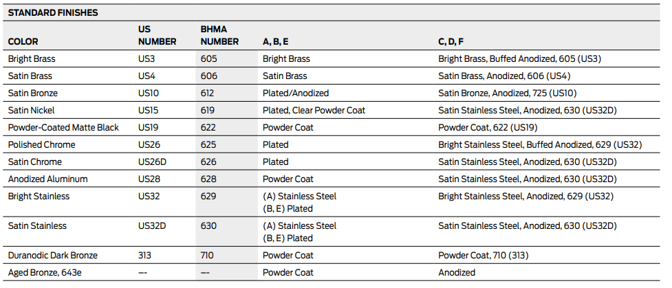
<a id="B.1.a"></a>
### **B.1.a Glynn Jhonson (`GJ_Price_Book_12_Feb2023_CAN010061.pdf`):**

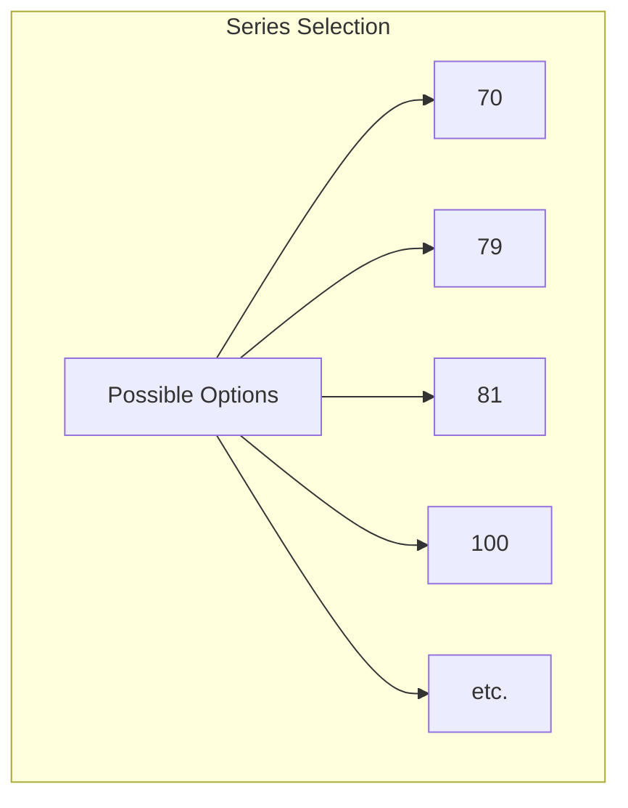
```mermaid
flowchart TD

subgraph Series Selection
G[Possible Options]
70
79
81
100
J[etc.]
end


G --> 70
G --> 79
G --> 81
G --> 100
G --> J
```

- **Product dependent Required Params:**

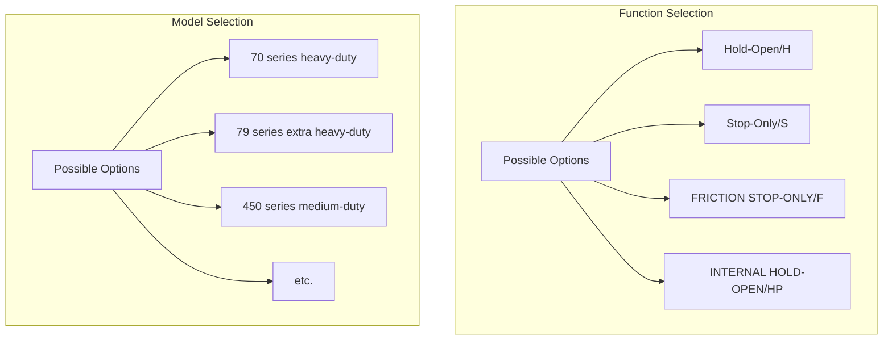
```mermaid
graph TB


subgraph Function Selection
D[Possible Options]
E[Hold-Open/H]
F[Stop-Only/S]
H[FRICTION STOP-ONLY/F]
K[INTERNAL HOLD-OPEN/HP]
end

subgraph Model Selection
A[Possible Options]
B[70 series heavy-duty]
C[79 series extra heavy-duty]
I[450 series medium-duty]
L[etc.]
end


A --> B
A --> C
A --> I
A --> L

D --> E
D --> F
D --> H
D --> K


```
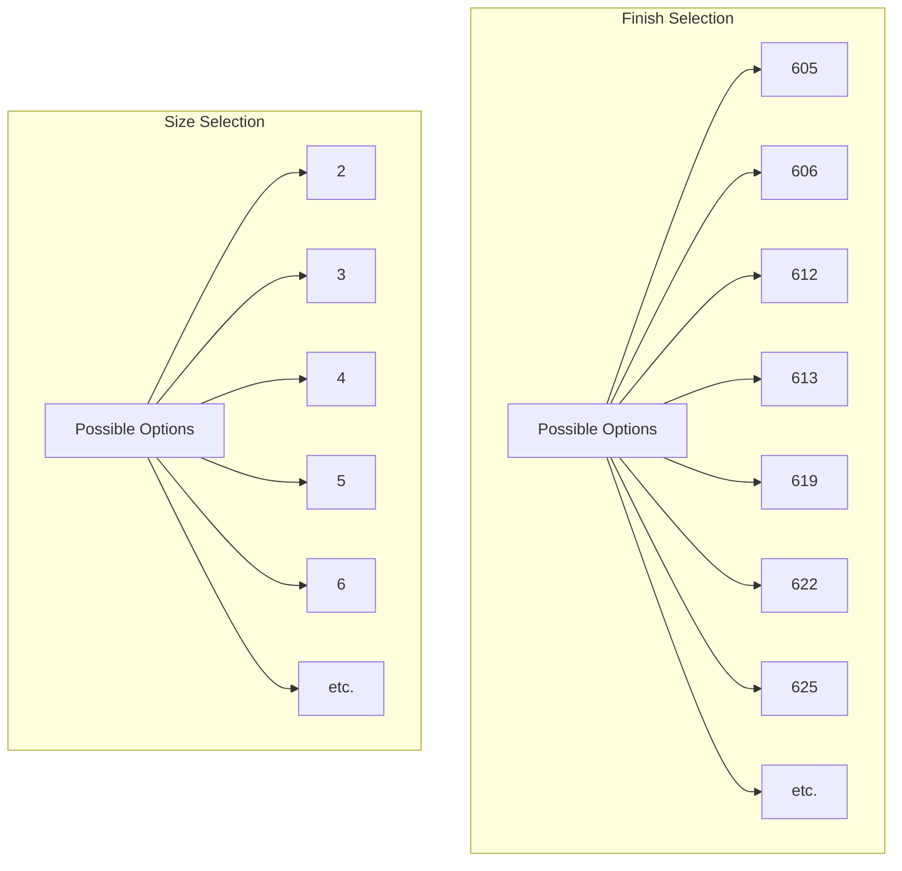
```mermaid
graph TB

subgraph Finish Selection
H[Possible Options]
605
606
612
613
619
622
625
I[etc.]
end

subgraph Size Selection
G[Possible Options]
2
3
4
5
6
L[etc.]
end

G --> 2
G --> 3
G --> 4
G --> 5
G --> 6
G --> L

H --> 605
H --> 606
H --> 612
H --> 613

H --> 619
H --> 622
H --> 625
H --> I

```

- **Base Price chart:**

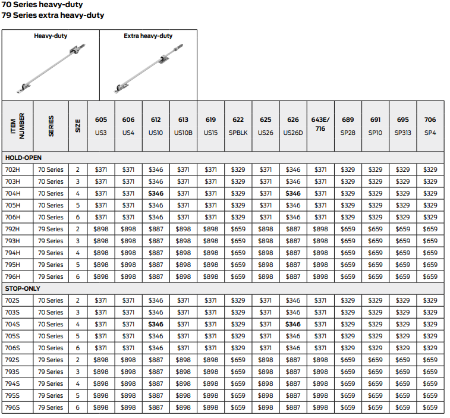
- **Optional Params:**

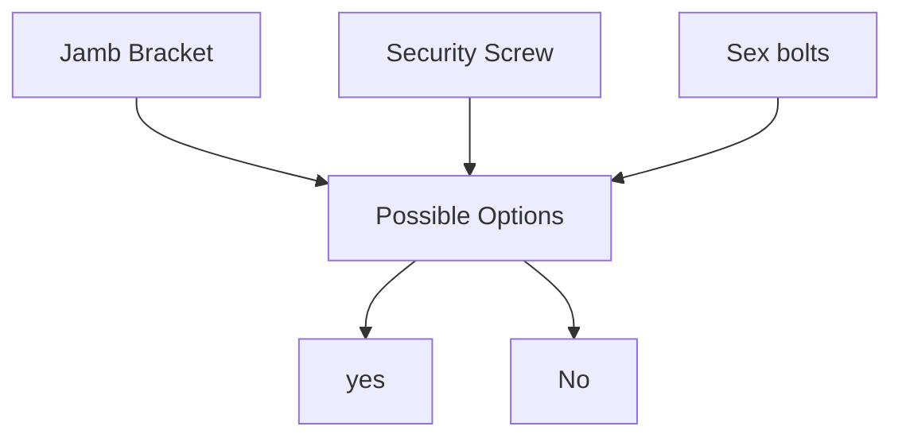
```mermaid
flowchart TD

A[Jamb Bracket]
B[Security Screw]
C[Sex bolts]
P[Possible Options]
A --> P 
B --> P 
C --> P 
P --> Y[yes] 
P --> N[No] 
```
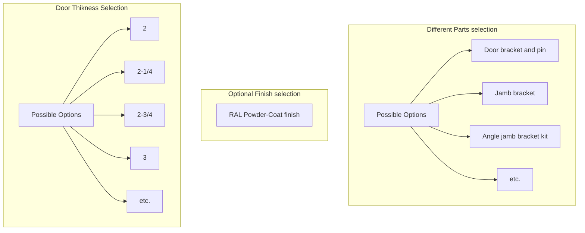
```mermaid
graph TB

subgraph Different Parts selection
G[Possible Options]
H[Door bracket and pin]
I[Jamb bracket]
J[Angle jamb bracket kit]
K[etc.]
end

subgraph Optional Finish selection
F[RAL Powder-Coat finish]
end

subgraph Door Thikness Selection
A[Possible Options]
B[2]
C[2-1/4]
D[2-3/4]
E[3]
L[etc.]
end

A --> B
A --> C
A --> D
A --> E
A --> L

G --> H
G --> I
G --> J
G --> K
```
- **Optional price chart:**

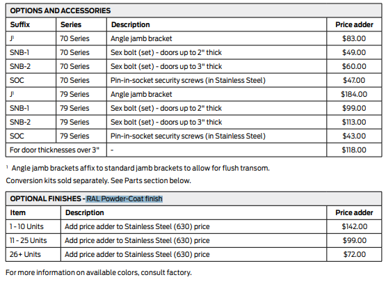


- Parts selection criteria
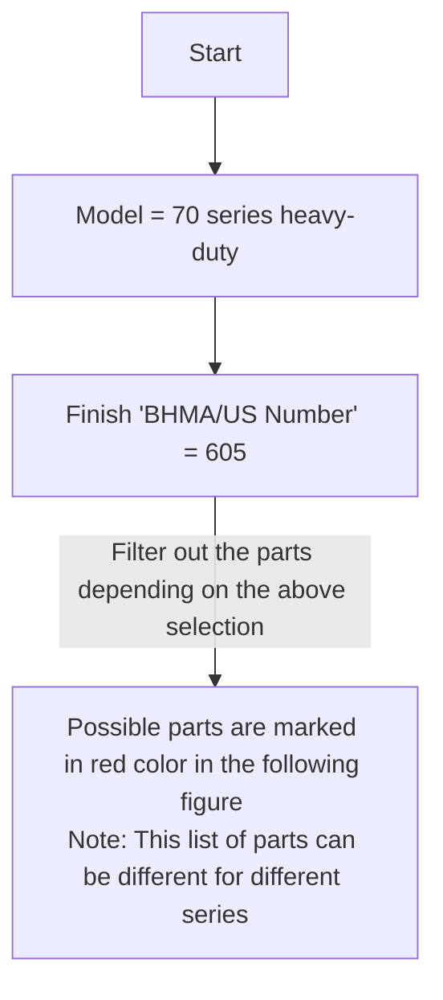
```mermaid
flowchart TD

A[Start] --> B[Model = 70 series heavy-duty]
 --> D[Finish 'BHMA/US Number' = 605] --> |Filter out the parts depending on the above selection| F[Possible parts are marked in red color in the following figure \n Note: This list of parts can  be different for different series]
```
- **Different part's Price chart:**

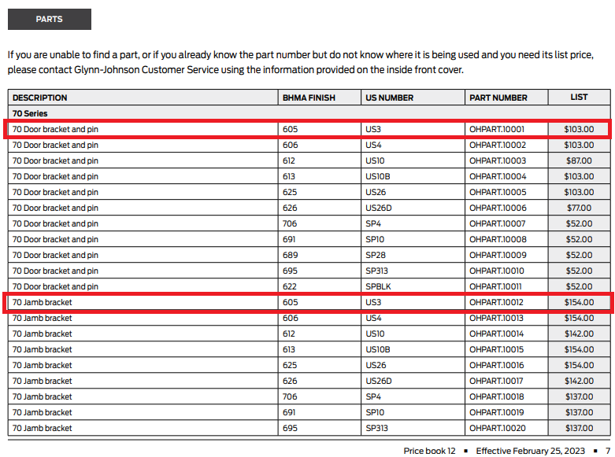
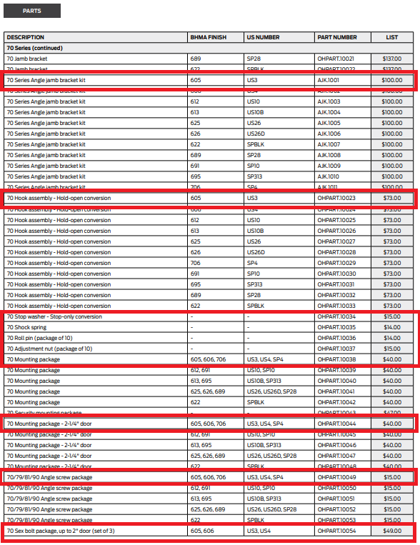

<a id="B.1.b"></a>
### **B.1.b Falcon (`CAN110065_FAL_Price_Book_13_Feb2023_RevJun2023_07-05-23.pdf`):**

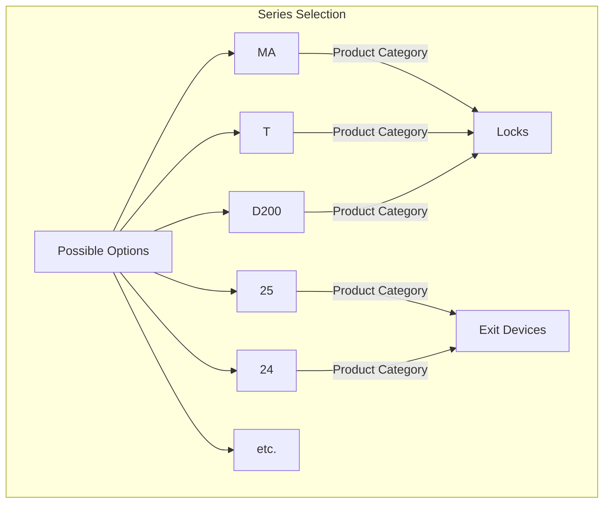
```mermaid
flowchart TD


subgraph Series Selection
A[Possible Options]
B[MA] 
C[T]
D[D200]
E[25]
F[24]
G[etc.]
H[Locks]
I[Exit Devices]
end

A --> B
A --> C
A --> D
A --> E
A --> F
A --> G
B --> |Product Category| H
C --> |Product Category| H
D --> |Product Category| H
E --> |Product Category| I
F --> |Product Category| I

```
**1. Locks [MA series, T Series, X Series, D-200 Series etc.]:**
- **Product dependent Required Params:**

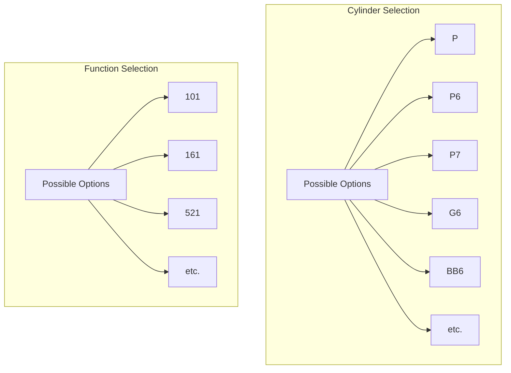
```mermaid
flowchart TD


subgraph Cylinder Selection
D[Possible Options]
P
P6
P7
G6
BB6
K[etc.]
end

subgraph Function Selection
A[Possible Options]
B[101]
C[161]
I[521]
L[etc.]
end

A --> B
A --> C
A --> I
A --> L

D --> P
D --> P6
D --> P7
D --> G6
D --> BB6
D --> K

```
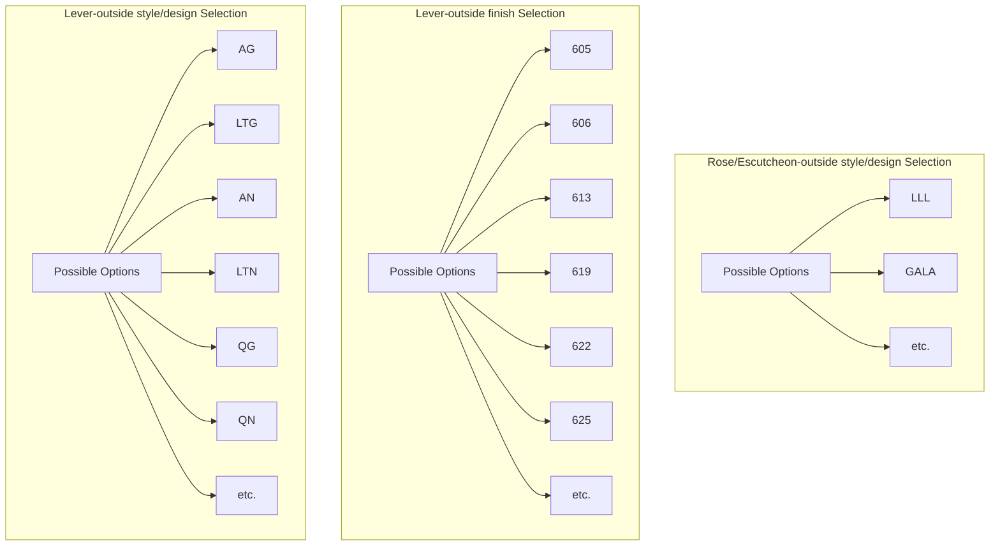
```mermaid
graph TB

subgraph Rose/Escutcheon-outside style/design Selection
A[Possible Options]
LLL
GALA
B[etc.]
end

subgraph Lever-outside finish Selection
H[Possible Options]
605
606
613
619
622
625
I[etc.]
end

subgraph Lever-outside style/design Selection
J[Possible Options]
AG
LTG
AN
LTN
QG
QN
K[etc.]
end


H --> 605
H --> 606
H --> 613
H --> 619
H --> 622
H --> 625
H --> I

J --> AG
J --> LTG
J --> AN
J --> LTN
J --> QG
J --> QN
J --> K

A --> LLL
A --> GALA
A --> B
```

- **Base Price chart:**

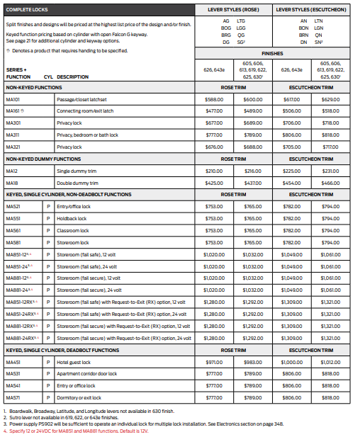


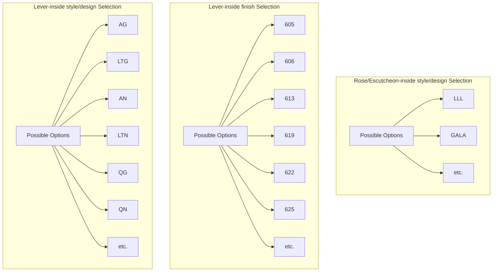
```mermaid
flowchart TD

subgraph Rose/Escutcheon-inside style/design Selection
A[Possible Options]
LLL
GALA
B[etc.]
end

subgraph Lever-inside finish Selection
H[Possible Options]
605
606
613
619
622
625
I[etc.]
end

subgraph Lever-inside style/design Selection
J[Possible Options]
AG
LTG
AN
LTN
QG
QN
K[etc.]
end


H --> 605
H --> 606
H --> 613
H --> 619
H --> 622
H --> 625
H --> I

J --> AG
J --> LTG
J --> AN
J --> LTN
J --> QG
J --> QN
J --> K

A --> LLL
A --> GALA
A --> B
```

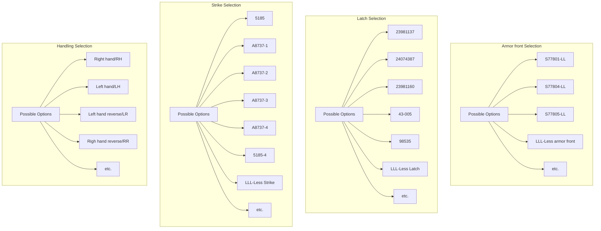
```mermaid
graph TB


subgraph Armor front Selection
N[Possible Options]
O[S77801-LL]
P[S77804-LL]
Q[S77805-LL]
R[LLL-Less armor front]
S[etc.]
end


subgraph Latch Selection
D[Possible Options]
E[23981137]
F[24074387]
G[23981160]
H[43-005]
I[98535]
J[LLL-Less Latch]
K[etc.]
end

subgraph Strike Selection
A[Possible Options]
A8737-1
A8737-2
A8737-3
A8737-4
5185
5185-4
C[LLL-Less Strike]
B[etc.]
end

subgraph Handling Selection
L[Possible Options]
RH[Right hand/RH]
LH[Left hand/LH]
LR[Left hand reverse/LR]
RR[Righ hand reverse/RR]
M[etc.]
end

N --> O
N --> P
N --> Q
N --> R
N --> S

D --> E
D --> F
D --> G
D --> H
D --> I
D --> J
D --> K

L --> RH
L --> LH
L --> LR
L --> RR
L --> M

A --> A8737-1
A --> A8737-2
A --> A8737-3
A --> A8737-4
A --> 5185
A --> 5185-4
A --> C
A --> B
```
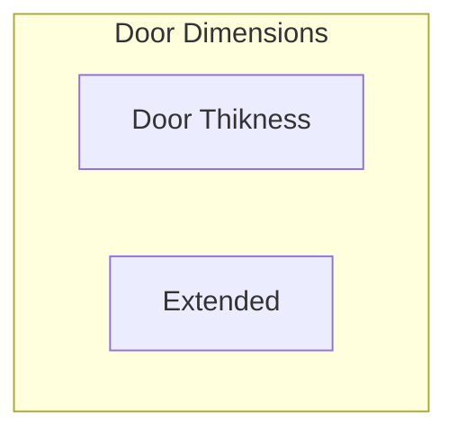
```mermaid
flowchart TD

subgraph Door Dimensions
A[Door Thikness]
Extended
end
```
- **Less component price list:**

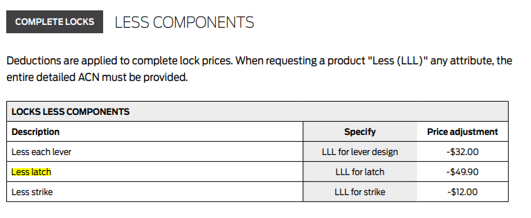
- **Optional Params:**
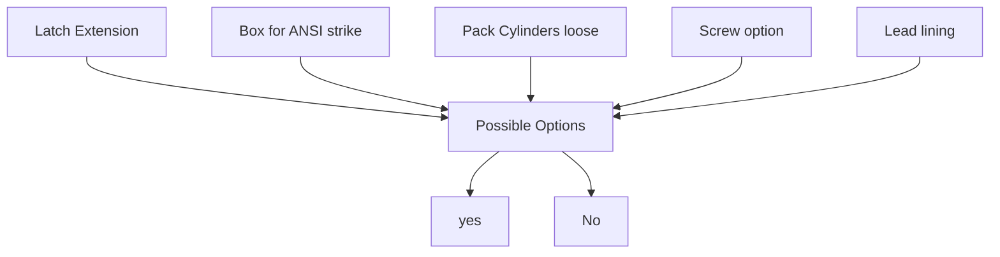
```mermaid
flowchart TD

A[Latch Extension]
B[Box for ANSI strike]
C[Pack Cylinders loose]
D[Screw option]
E[Lead lining]
P[Possible Options]
A --> P 
B --> P 
C --> P 
D --> P 
E --> P
P --> Y[yes] 
P --> N[No] 
```
`Lead lining` depends on the `Lever-outside design`.
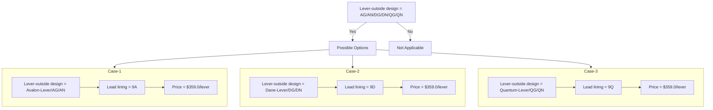
```mermaid
flowchart TD

P[Lever-outside design = AG/AN/DG/DN/QG/QN]
-->  |Yes| Q[Possible Options] 
Q --> Case-1
Q --> Case-2
Q --> Case-3
P --> |No| N[Not Applicable]
subgraph Case-3
G[Lever-outside design = Quantum-Lever/QG/QN] --> H[Lead lining = 9Q] --> I[Price = $359.0/lever]
end

subgraph Case-2
D[Lever-outside design = Dane-Lever/DG/DN] --> E[Lead lining = 9D] --> F[Price = $359.0/lever]
end


subgraph Case-1
A[Lever-outside design = Avalon-Lever/AG/AN] --> B[Lead lining = 9A] --> C[Price = $359.0/lever]
end

```
- **Optional price list:**

  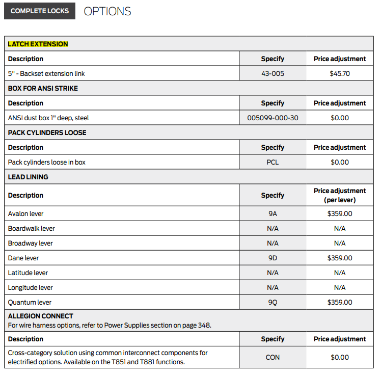

  Optinal Params indicator
  
  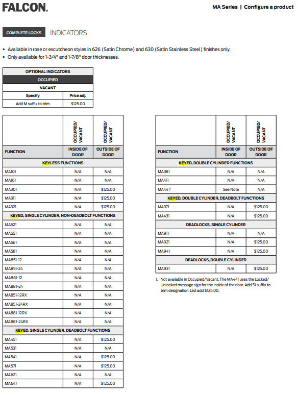


**2. Exit Devices [25 Series, 24 Series, 2390 Series etc.]:**
- **Product dependent Required Params:**
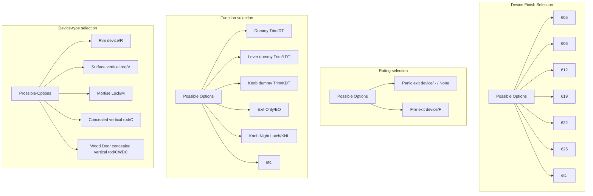
```mermaid
graph TB

subgraph Device Finish Selection
Q[Possible Options]
Q --> 605
Q --> 606
Q --> 612
Q --> 619
Q --> 622
Q --> 625
Q --> R[etc.]
end

subgraph Rating selection
N[Possible Options] --> O[Panic exit device/ - / None]
N --> P[Fire exit device/F]
end

subgraph Function selection
G[Possible Options] --> H[Dummy Trim/DT]
G --> I[Lever dummy Trim/LDT]
G --> J[Knob dummy Trim/KDT]
G --> K[Exit Only/EO]
G --> L[Knob Night Latch/KNL]
G --> M[etc.]
end

subgraph Device-type selection
A[Prossible-Options] --> B[Rim device/R]
A --> C[Surface vertical rod/V]
A --> D[Mortise Lock/M]
A --> E[ Concealed vertical rod/C]
A --> F[Wood Door concealed vertical rod/CWDC]
end

```
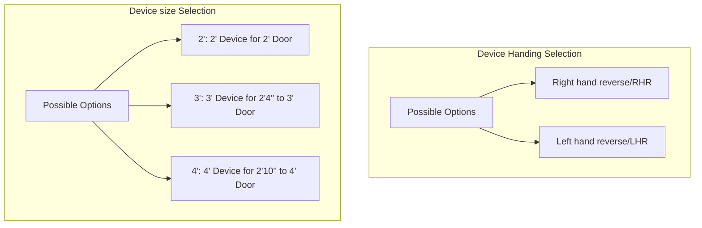
```mermaid
graph TB


subgraph Device Handing Selection
E[Possible Options] --> F[Right hand reverse/RHR]
E --> G[Left hand reverse/LHR]
end

subgraph Device size Selection
A[Possible Options]
A --> B[2': 2' Device for 2' Door]
A --> C[3': 3' Device for 2'4'' to 3' Door]
A --> D[4': 4' Device for 2'10'' to 4' Door]
end

```
- **Base price chart:**

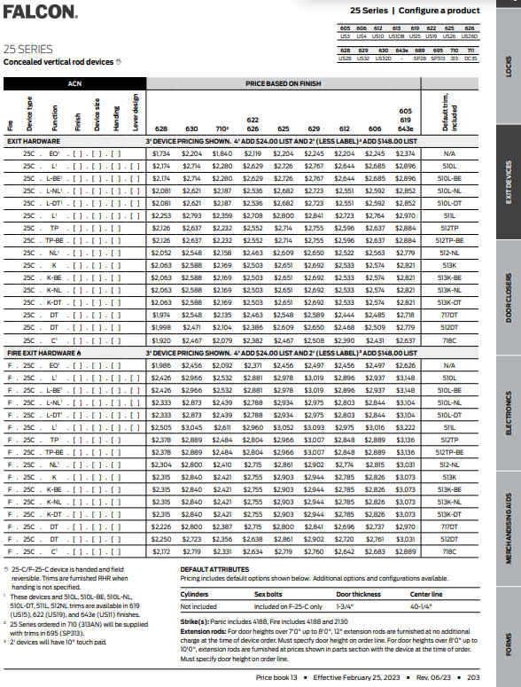
- **Optional Params:**
  ```mermaid
  graph TB


  subgraph Device Trim Finish Selection
  K[Possible Options]
  K --> 605
  K --> 606
  K --> 629
  K --> 695
  K --> 710
  K --> R[etc.]
  end

  subgraph Device Trim Design Selection
  A[Possible Options] --> B[Avalon/AVA]
  A --> C[Broadway/BRW]
  A --> D[Boardwalk/BRK]
  A --> E[Dane/DAN]
  A --> F[Sutro/SUT]
  A --> G[Danish/DSH]
  A --> H[Latitude/LAT]
  A --> I[Longitude/LON]
  A --> J[Quantum/QUA]
  end

  subgraph Device Trim Design Type Selection
  O[Possible Options] --> P[Standard Lever]
  O --> Q[Knurled Lever]
  end

  subgraph Device Trim Selection
  S[Possible Options] --> T[510L/Lever trim]
  S --> U[511L/Vanda-resistant lever trim]
  S --> V[L/Less trim]
  S --> W[512/Pull trim]
  S --> X[513K/Knob trim]
  S --> Y[717/Delta trim]
  end

  ```
  **Trim price chart:**

  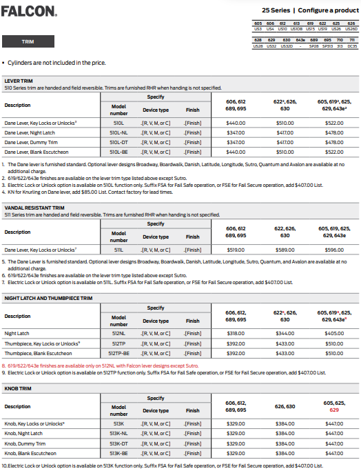
  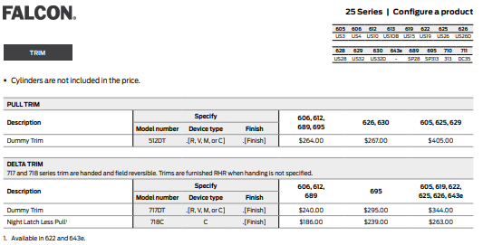

    ```mermaid
    flowchart TD


    subgraph Device Strike Selection
    A[Possible Options]
    A --> 264
    A --> 299
    A --> 3788
    A --> 2130
    A --> 1279
    A --> R[etc.]
    end
  ```
  **Strike price chart:**

  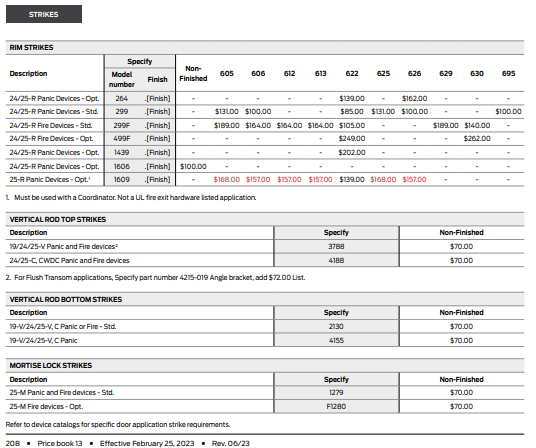

  

  ```mermaid
    flowchart TD

    A[Accessible]
    B[Exit Alarm]
    C[Sexbolts]
    D[SLM Blocking]
    E[GBK/Shim Kit/Risers]
    P[Possible Options]
    A --> P 
    B --> P 
    C --> P 
    D --> P 
    E --> P
    P --> Y[yes] 
    P --> N[No] 
  ```
  
  ```mermaid
  graph TB

  subgraph Dogging Selection
  G[Possible Options]
  G --> H[LD: Less Dogging]
  G --> I[CD: Cylinder Dogging]
  end

  subgraph Rods for surface/concealed Selection
  D[Possible Options]
  D --> E[LBR: Less Bottom Rod]
  D --> F[LBR-AFL: Less Bottom Rod w/Auxiliary Fire Pin]
  end

  subgraph Mortise lock Selection
  A[Possible Options]
  A --> B[LL: Less Lock]
  A --> C[8500: Standard Mortise]
  end
  ```
  
  ```mermaid
  graph TB

  subgraph Storm rating Selection
  T[Possible Options]
  T --> U[HH: Wind and Impact - Hurricane Rated]
  end

  subgraph Electrical locking Selection
  Q[Possible Options]
  Q --> R[FSA: Fail Safe]
  Q --> S[FSE: Fail Secure]
  end


  subgraph Latch Retraction Selection
  O[Possible Options]
  O --> P[MEL: Motorized Electric Latch Retraction]
  end

  subgraph Switch Selection
  J[Possible Options]
  J --> K[RX: Request to Exit Pushbar Monitor]
  J --> L[DM: Latchbolt and Pushbar Monitor]
  J --> M[DM-RX: Latchbolt and Dual Pushbar Monitor]
  J --> N[KOR: Key Bypass Switch]
  end
  ```

  ```mermaid
  graph TB

  subgraph Center line Selection
  T[Possible Options]
  T --> U[40'']
  T --> V[40-1/4'']
  T --> W[40-5/16'']
  T --> X[40-9/16'']
  T --> Y[34-1/16'']
  T --> Z[etc.]
  end
  
  
  subgraph Door Thickness Selection
  O[Possible Options]
  O --> P[DT1-3/4: 1-3/'']
  O --> Q[DT2: 2'' thickness]
  O --> R[DT2-1/4: 2-1/4'']
  end


  subgraph Door Mode Material Selection
  K[Possible Options]
  K --> L[DE: Double egress doors]
  K --> M[PR: Pair of doors]
  K --> N[SGL: Single door]
  end

  
  subgraph Frame Material Selection
  G[Possible Options]
  G --> H[ALF: Aluminum frame]
  G --> I[HMF: Hollow metal frame]
  G --> J[WDF: Wood door frame]
  end

  subgraph Door Material Selection
  A[Possible Options]
  A --> B[ALD: Aluminum door]
  A --> C[CPD: Composite door]
  A --> D[HMD: Hollow metal door]
  A --> E[WDF: Wood door frame]
  A --> F[SCDC: Steel channel door construction]
  end
  ```

  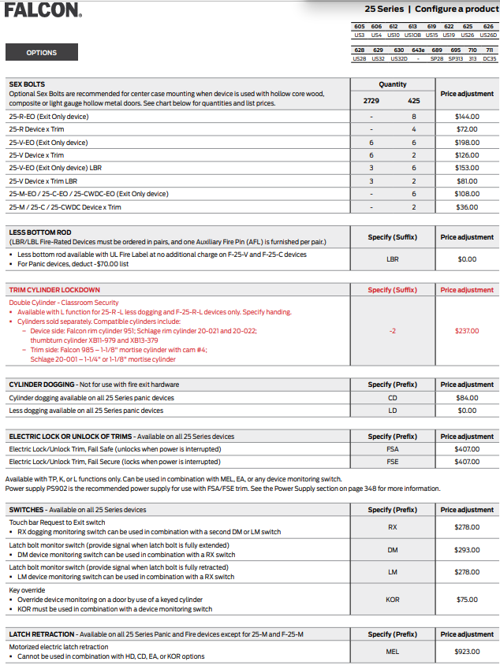
  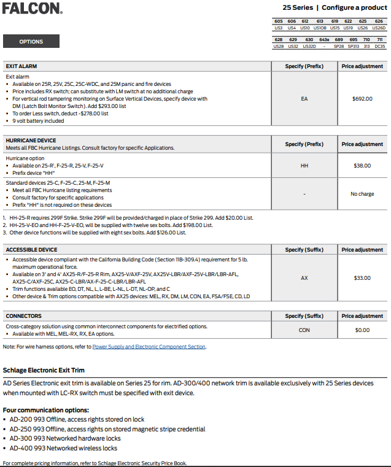

<a id="B.1.c"></a>
### **B.1.c LCN (`CAN113462_LCN_Price_Book_13_Feb2023_RevJun2023_07-05-23.pdf`):**

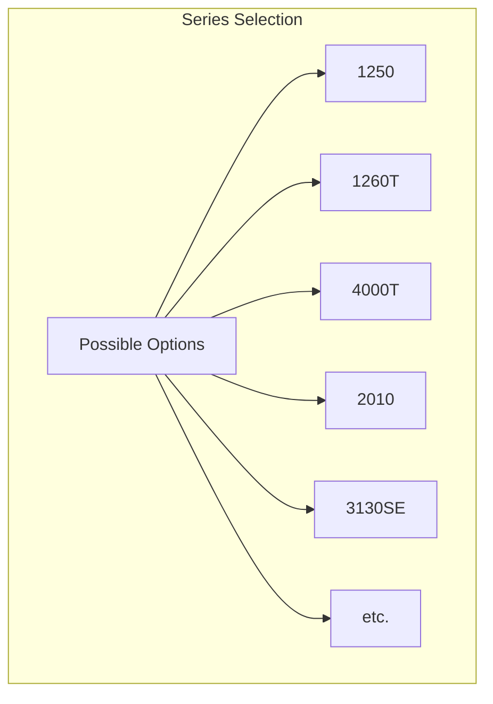
```mermaid
flowchart TD


subgraph Series Selection
A[Possible Options]
B[1250] 
C[1260T]
D[4000T]
E[2010]
F[3130SE]
G[etc.]
end

A --> B
A --> C
A --> D
A --> E
A --> F
A --> G

```
- **Product dependent Required Params:**

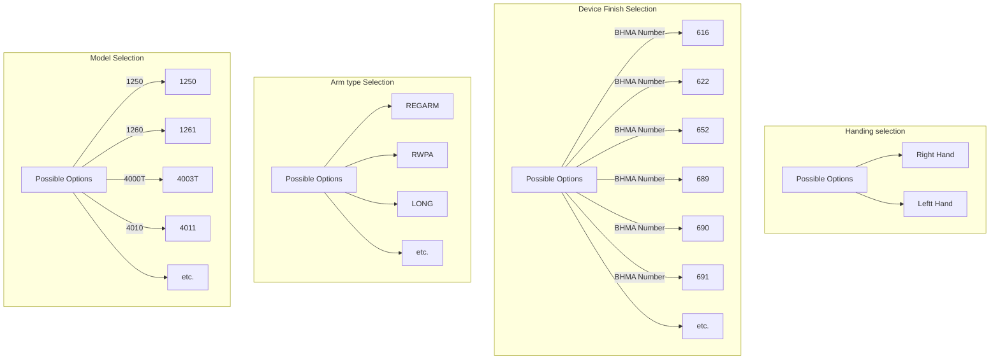
```mermaid
graph TB

subgraph Handing selection
S[Possible Options]
S --> RH[Right Hand]
S --> LH[Leftt Hand]
end

subgraph Device Finish Selection
Q[Possible Options]
Q --> |BHMA Number| 616
Q --> |BHMA Number| 652
Q --> |BHMA Number| 691
Q --> |BHMA Number| 690
Q --> |BHMA Number| 622
Q --> |BHMA Number| 689
Q --> R[etc.]
end


subgraph Arm type Selection
G[Possible Options]
H[REGARM]
I[RWPA]
J[LONG]
K[etc.]
end


subgraph Model Selection
A[Possible Options]
B[1250]
C[1261]
D[4003T]
E[4011]
F[etc.]
end

A --> |1250| B
A --> |1260| C
A --> |4000T| D
A --> |4010| E
A --> F

G --> H
G --> I
G --> J
G --> K

```
- **Base price chart:**

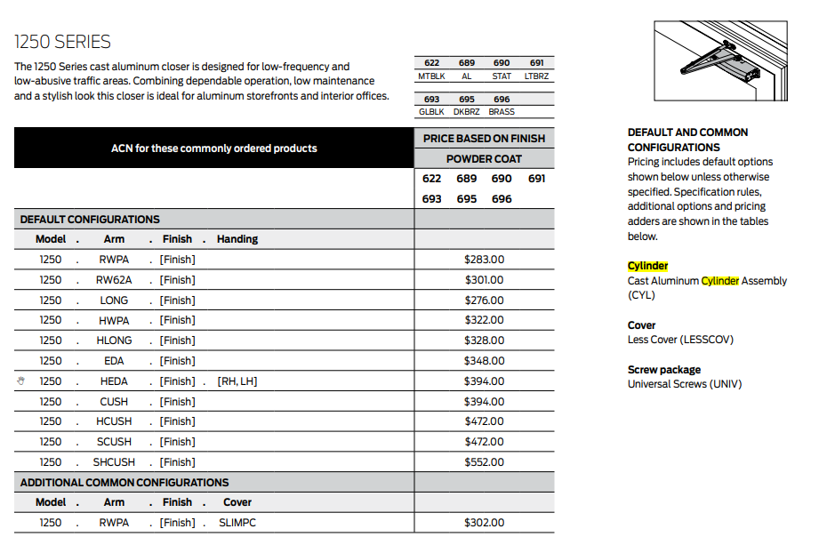
- **Optional Params:**

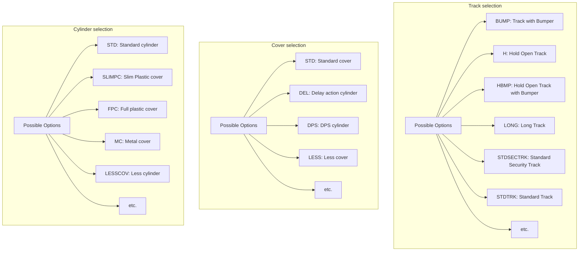
```mermaid
graph TB


subgraph Track selection
N[Possible Options] --> O[BUMP: Track with Bumper]
N --> P[H: Hold Open Track]
N --> Q[HBMP: Hold Open Track with Bumper]
N --> R[LONG: Long Track]
N --> S[STDSECTRK: Standard Security Track]
N --> T[STDTRK: Standard Track]
N --> U[etc.]
end

subgraph Cover selection
A[Possible Options] --> B[STD: Standard cover]
A --> C[DEL: Delay action cylinder]
A --> D[DPS: DPS cylinder]
A --> E[LESS: Less cover]
A --> F[etc.]
end

subgraph Cylinder selection
G[Possible Options] --> H[STD: Standard cylinder]
G --> I[SLIMPC: Slim Plastic cover]
G --> J[FPC: Full plastic cover]
G --> K[MC: Metal cover]
G --> L[LESSCOV: Less cylinder]
G --> M[etc.]
end

```

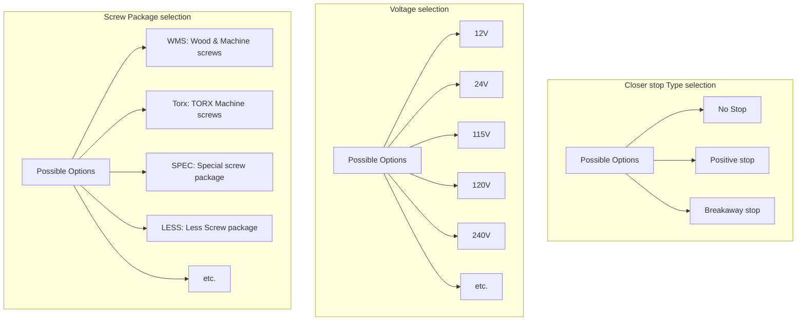
```mermaid
flowchart TD

subgraph Closer stop Type selection
N[Possible Options] --> O[No Stop]
N --> P[Positive stop]
N --> Q[Breakaway stop]
end

subgraph Voltage selection
G[Possible Options] --> H[12V]
G --> I[24V]
G --> J[115V]
G --> K[120V]
G --> L[240V]
G --> M[etc.]
end

subgraph Screw Package selection
A[Possible Options] --> B[WMS: Wood & Machine screws]
A --> C[Torx: TORX Machine screws]
A --> D[SPEC: Special screw package]
A --> E[LESS: Less Screw package]
A --> F[etc.]
end

```

```mermaid
flowchart TD


subgraph Header Bracket selection
A[Possible Options] --> B[Angle Brackets]
A --> C[Dress plates]
end

subgraph Header Length selection
Q[Possible Options] --> R[33]
Q --> S[33-1/8]
Q --> T[33-1/4]
Q --> U[33-3/8]
Q --> V[33-1/2]
Q --> W[33-5/8]
Q --> X[33-3/4]
Q --> Y[33-7/8]
Q --> Z[34]
Q --> ZZ[etc.]
end

subgraph Header Type selection
N[Possible Options] --> O[HDR: Single door]
N --> P[HDR2: Double door]
end
```

```mermaid
flowchart TD


subgraph Controller selection
A[Possible Options] --> B[CTRL: Standard Controller]
A --> C[CTRL2: Standard Controller, pair]
end

subgraph Spindle center selection
Q[Possible Options] --> R[2-3/4]
Q --> S[3-3/4]
Q --> T[12-1/4]
end

subgraph Gearbox selection
N[Possible Options] --> O[MGB: Standard Motor Gearbox]
N --> P[MGB2: Standard Motor Gearbox, Pair]
end
```

```mermaid
flowchart TD

G[SRI Primer]
H[Buy america act]
I[Flush ceiling application]
J[Concealed switch]
P[Possible Options]
G --> P 
H --> P 
I --> P 
J --> P 
P --> Y[yes] 
P --> N[No] 

```
- **Optional price chart:**

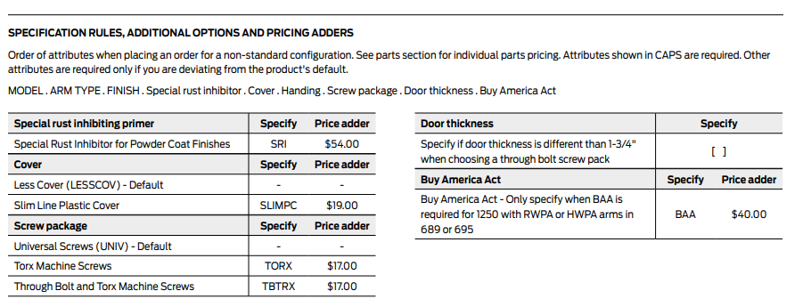

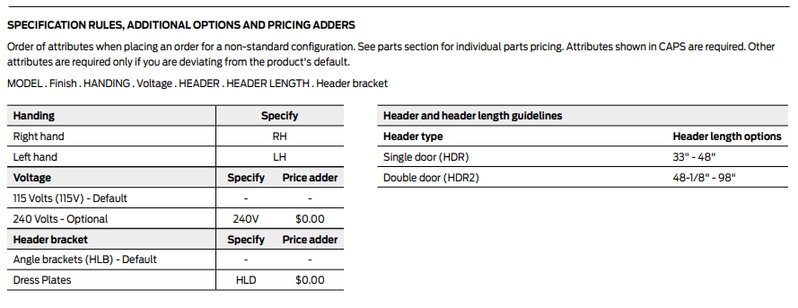


