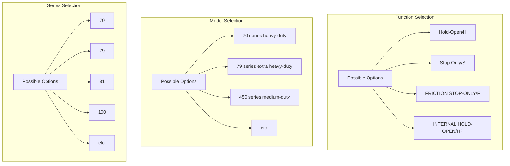
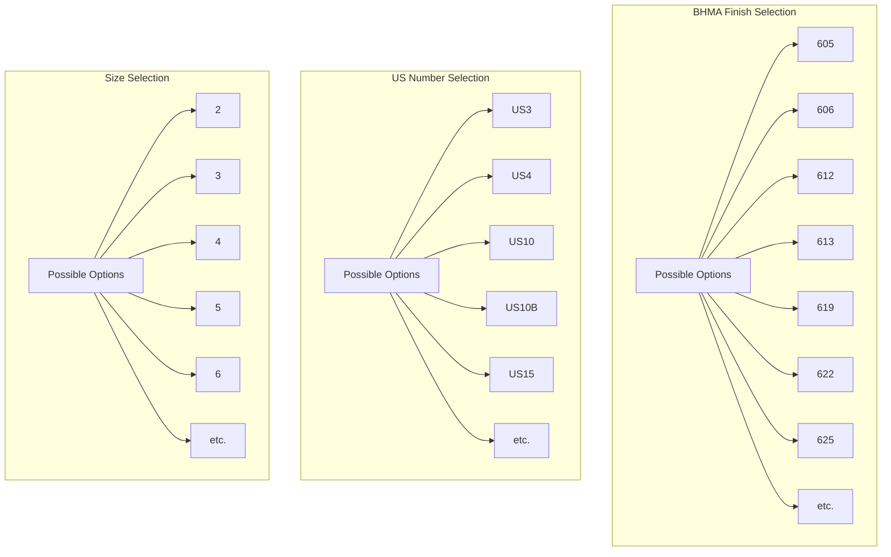
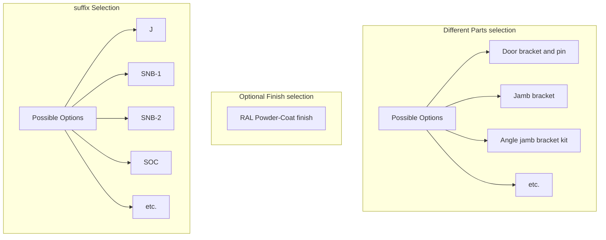
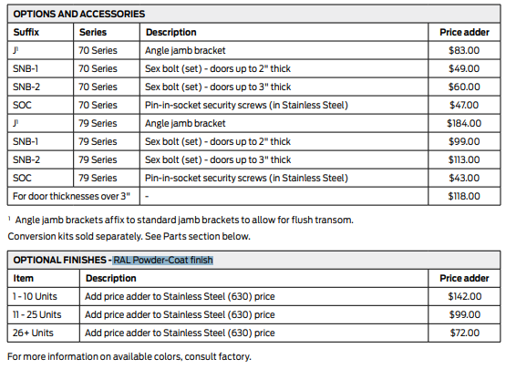
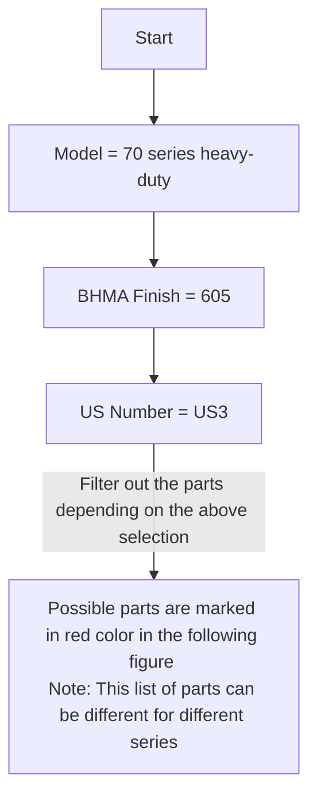

# A. Proposed DB Structure

Proposed Structure for storing the pricebook information.


```
{
  "category": "hw",
  "groupDesc": "100 series",
  "code": "100 Series",
  "products": [
    {
      "desc": "100 Series overhead concealed",
      "code": "10",
      "features": [
        {
          "desc": "bhma finish",
          "code": "finish",
          "options": [
            {
              "desc": "605",
              "code": "605",
              "availabilityCriteria": [],
              "dependentFeatures": []
            },
            {
              "desc": "606",
              "code": "606",
              "availabilityCriteria": [],
              "dependentFeatures": []
            }
          ],
          "dependentFetures": [],
        },
        {
          "desc": "US Number",
          "code": "USN",
          "options": [
            {
              "desc": "US3",
              "code": "US3",
              "availabilityCriteria": [],
              "dependentFeatures": []
            },
            {
              "desc": "US4",
              "code": "US4",
              "availabilityCriteria": [],
              "dependentFeatures": []
            }
          ],
          "dependentFetures": []
        },
        {
          "desc": "size",
          "code": "size",
          "options": [
            {
              "desc": "size-2",
              "code": "2",
              "availabilityCriteria": [],
              "dependentFeatures": []
            },
            {
              "desc": "size-3",
              "code": "3",
              "availabilityCriteria": [],
              "dependentFeatures": []
            }
          ],
          "dependentFetures": []
        },
        {
          "desc": "Funtion",
          "code": "Function",
          "options": [
            {
              "desc": "Hold-Open",
              "code": "H",
              "availabilityCriteria": [],
              "dependentFeatures": []
            },
            {
              "desc": "Stop-Only",
              "code": "S",
              "availabilityCriteria": [],
              "dependentFeatures": []
            }
          ],
          "dependentFetures": []
        }
      ],
      "priceList": [
        {
          "desc": "10,size 1, Hold-Open, 605 BHMA Finish, US3 US Number",
          "code": "10-1-H-605-US3",
          "pricePerQuantity": [
            {
                "unit": "Piece",
                "price": 513
            }
          ],
        },
        {
          "desc": "10,size 1,Stop-Only, 605 BHMA Finish, US3 US Number",
          "code": "10-1-S-605-US3",
          "pricePerQuantity": [
            {
                "unit": "Piece",
                "price": 513
            }
          ]
        }
      ],
      "adonFeatures": [
        {
          "desc": "suffix",
          "code": "suffix",
          "options": [
            {
              "desc": "Stop-Only function for use with Single point hold-open electronic closers.",
              "code": "SE",
              "pricePerQuantity": [
                {
                    "unit": "Piece",
                    "price": 40
                }
              ],
              "availabilityCriteria": [],
              "dependentFeatures": []
            },
            {
              "desc": "Adjustable jamb bracket available on models 103-106 (Allows for field adjustment of Hold-Open 85° - 110°)",
              "code": "ADJ",
              "pricePerQuantity": [
                {
                    "unit": "Piece",
                    "price": 92
                }
              ],
              "availabilityCriteria": [
                {
                    "featureCode": "size",
                    "featureOptions": ["3","4","5","6"]
                }],
              "dependentFeatures": []
            }
          ],
          "dependentFetures": []
        }
      ]
    }
  ]
}
```

The above structure has been generated depending on the following files.
###### **Allegion**:
`GJ_Price_Book_12_Feb2023_CAN010061.pdf`,
`CAN110065_FAL_Price_Book_13_Feb2023_RevJun2023_07-05-23.pdf`,
`SCH_Residential_Price_Book_13_MRCAN1000.pdf`,
`CAN110962_Zero_Price_Book_10_Feb2023_RevJun2023_07-05-23.pdf`,
###### **KNC**:
`KNC - Price Book - Feb 26, 2023 18% Surcharge.pdf`
###### **NGP**:
`NGP - Price Book 2023.pdf`


# B. Different paramiter list:
Manufaturer wise PDF and their corresponding paramiter list.

## B.1 Allegion:
#### Glynn Jhonson (`GJ_Price_Book_12_Feb2023_CAN010061.pdf`):

- **Required Params:**




- Price chart


- **Optional Params:**


- Adon price chart




- Parts selection criteria

- Different part's Price chart


