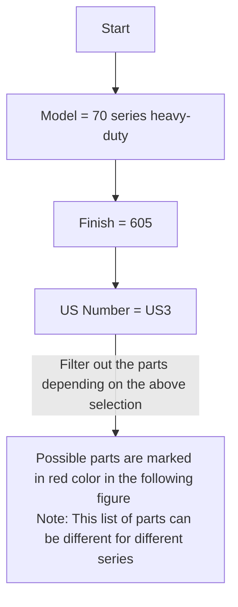
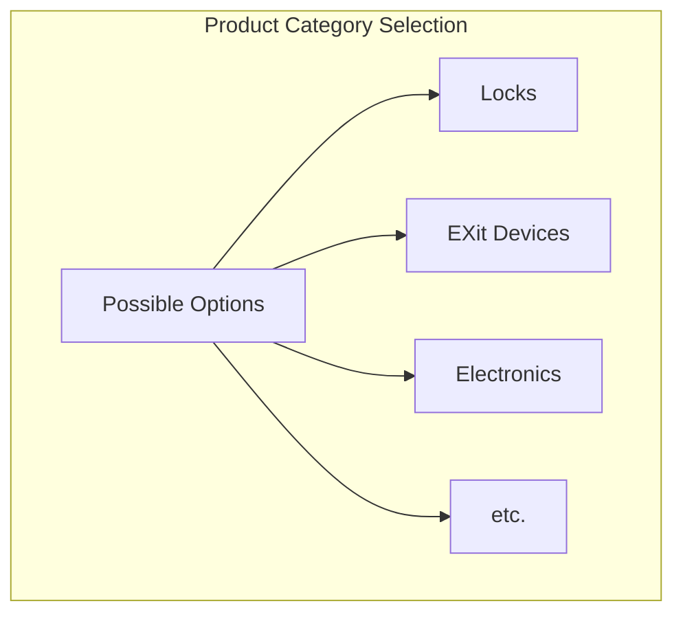
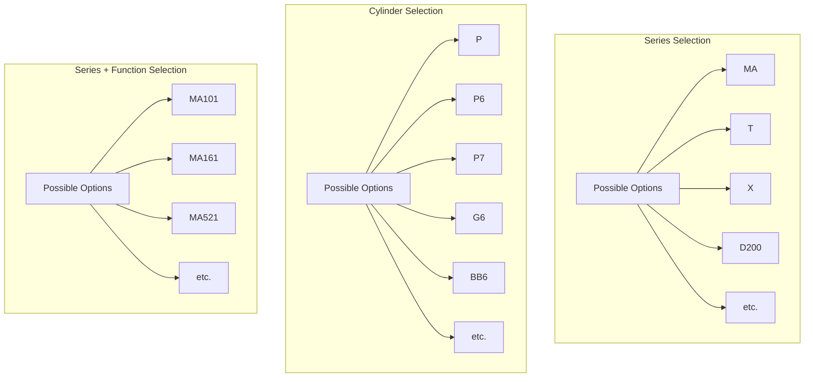

# A. Proposed DB Structure

Proposed Structure for storing the pricebook information.


```
{
  "category": "hw",
  "groupDesc": "100 series",
  "code": "100 Series",
  "products": [
    {
      "desc": "100 Series overhead concealed",
      "code": "10",
      "features": [
        {
          "desc": "bhma Number/US Number of finish",
          "code": "finish",
          "options": [
            {
              "desc": "605",
              "code": "605",
              "availabilityCriteria": [],
              "dependentFeatures": []
            },
            {
              "desc": "606",
              "code": "606",
              "availabilityCriteria": [],
              "dependentFeatures": []
            }
          ],
          "dependentFetures": [],
        },
        {
          "desc": "size",
          "code": "size",
          "options": [
            {
              "desc": "size-2",
              "code": "2",
              "availabilityCriteria": [],
              "dependentFeatures": []
            },
            {
              "desc": "size-3",
              "code": "3",
              "availabilityCriteria": [],
              "dependentFeatures": []
            }
          ],
          "dependentFetures": []
        },
        {
          "desc": "Funtion",
          "code": "Function",
          "options": [
            {
              "desc": "Hold-Open",
              "code": "H",
              "availabilityCriteria": [],
              "dependentFeatures": []
            },
            {
              "desc": "Stop-Only",
              "code": "S",
              "availabilityCriteria": [],
              "dependentFeatures": []
            }
          ],
          "dependentFetures": []
        }
      ],
      "priceList": [
        {
          "desc": "10,size 1, Hold-Open, 605 BHMA Finish, US3 US Number",
          "code": "10-1-H-605-US3",
          "pricePerQuantity": [
            {
                "unit": "Piece",
                "price": 513
            }
          ],
        },
        {
          "desc": "10,size 1,Stop-Only, 605 BHMA Finish, US3 US Number",
          "code": "10-1-S-605-US3",
          "pricePerQuantity": [
            {
                "unit": "Piece",
                "price": 513
            }
          ]
        }
      ],
      "adonFeatures": [
        {
          "desc": "suffix",
          "code": "suffix",
          "options": [
            {
              "desc": "Stop-Only function for use with Single point hold-open electronic closers.",
              "code": "SE",
              "pricePerQuantity": [
                {
                    "unit": "Piece",
                    "price": 40
                }
              ],
              "availabilityCriteria": [],
              "dependentFeatures": []
            },
            {
              "desc": "Adjustable jamb bracket available on models 103-106 (Allows for field adjustment of Hold-Open 85° - 110°)",
              "code": "ADJ",
              "pricePerQuantity": [
                {
                    "unit": "Piece",
                    "price": 92
                }
              ],
              "availabilityCriteria": [
                {
                    "featureCode": "size",
                    "featureOptions": ["3","4","5","6"]
                }],
              "dependentFeatures": []
            }
          ],
          "dependentFetures": []
        }
      ]
    }
  ]
}
```

The above structure has been generated depending on the following files.
###### **Allegion**:
`GJ_Price_Book_12_Feb2023_CAN010061.pdf`,
`CAN110065_FAL_Price_Book_13_Feb2023_RevJun2023_07-05-23.pdf`,
`SCH_Residential_Price_Book_13_MRCAN1000.pdf`,
`CAN110962_Zero_Price_Book_10_Feb2023_RevJun2023_07-05-23.pdf`,
###### **KNC**:
`KNC - Price Book - Feb 26, 2023 18% Surcharge.pdf`
###### **NGP**:
`NGP - Price Book 2023.pdf`


# **B. Different paramiter list:**
Manufaturer wise PDF and their corresponding paramiter list.

## **B.1 Allegion:**
- Need to follow the common coding format for some parameters.

#### **B.1.a Glynn Jhonson (`GJ_Price_Book_12_Feb2023_CAN010061.pdf`):**

- **Required Params:**


- **Base Price chart:**


- **Adon Params:**


- **Adon price chart:**


- Parts selection criteria

- **Different part's Price chart:**


#### **B.1.b Falcon (`CAN110065_FAL_Price_Book_13_Feb2023_RevJun2023_07-05-23.pdf`):**


**1. Locks:**
- **Product dependent Required Params:**




- **Base Price chart:**


- **Less component price list:**


- **Adon Params:**

`Lead lining` depends on the `Lever-outside design`.

- **Adon price list:**


**2. Exit Devices:**
- **Product dependent Required Params:**


- **Base price chart:**


- **Optional Params:**
  ```mermaid
  graph TB


  subgraph Device Trim Finish Selection
  K[Possible Options]
  K --> 605
  K --> 606
  K --> 629
  K --> 695
  K --> 710
  K --> R[etc.]
  end

  subgraph Device Trim Design Selection
  A[Possible Options] --> B[Avalon/AVA]
  A --> C[Broadway/BRW]
  A --> D[Boardwalk/BRK]
  A --> E[Dane/DAN]
  A --> F[Sutro/SUT]
  A --> G[Danish/DSH]
  A --> H[Latitude/LAT]
  A --> I[Longitude/LON]
  A --> J[Quantum/QUA]
  end

  subgraph Device Trim Design Type Selection
  O[Possible Options] --> P[Standard Lever]
  O --> Q[Knurled Lever]
  end

  subgraph Device Trim Selection
  S[Possible Options] --> T[510L/Lever trim]
  S --> U[511L/Vanda-resistant lever trim]
  S --> V[L/Less trim]
  S --> W[512/Pull trim]
  S --> X[513K/Knob trim]
  S --> Y[717/Delta trim]
  end

  ```
  **Trim price chart:**

  
  

    ```mermaid
    flowchart TD


    subgraph Device Strike Selection
    A[Possible Options]
    A --> 264
    A --> 299
    A --> 3788
    A --> 2130
    A --> 1279
    A --> R[etc.]
    end
  ```
  **Strike price chart:**

  


