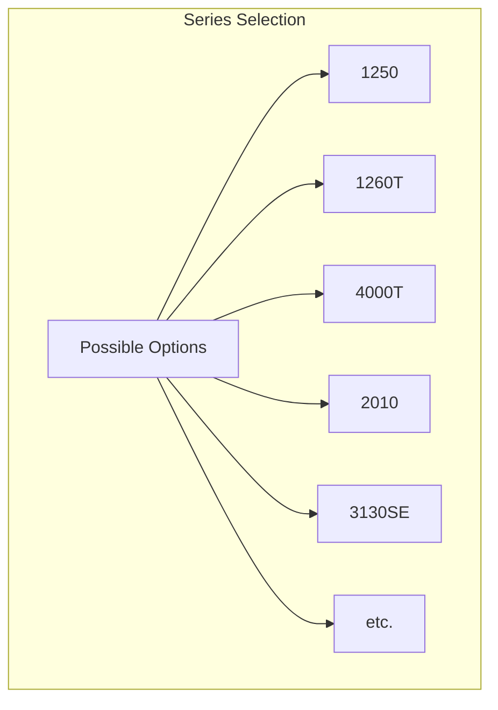
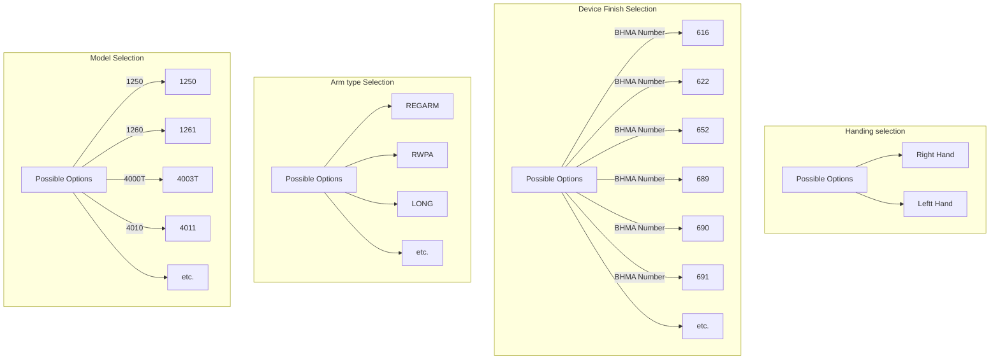
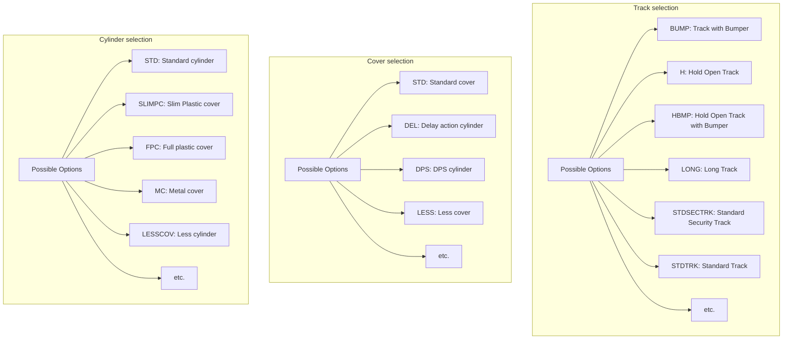
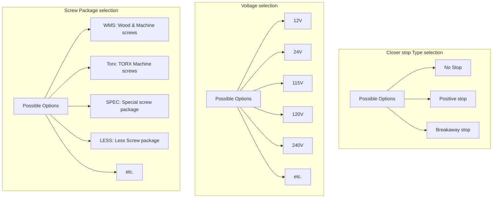
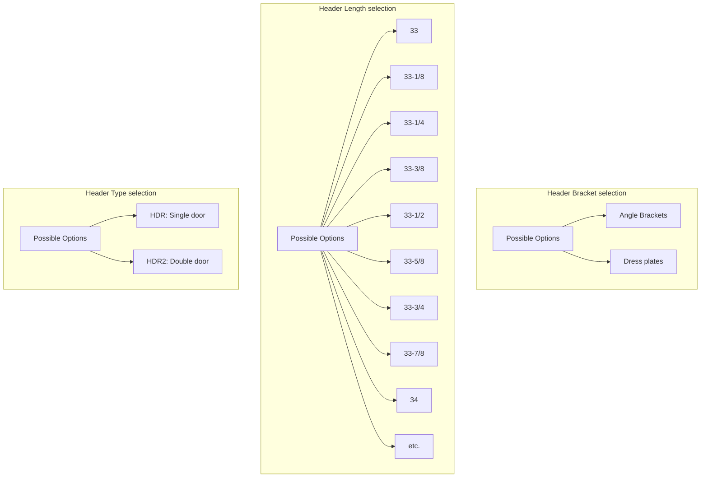
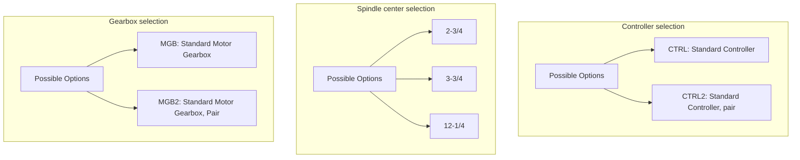
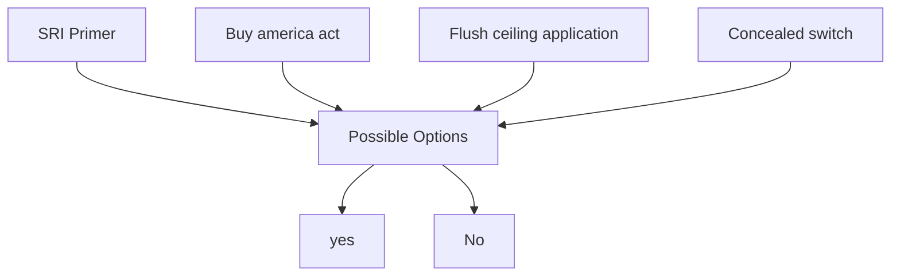
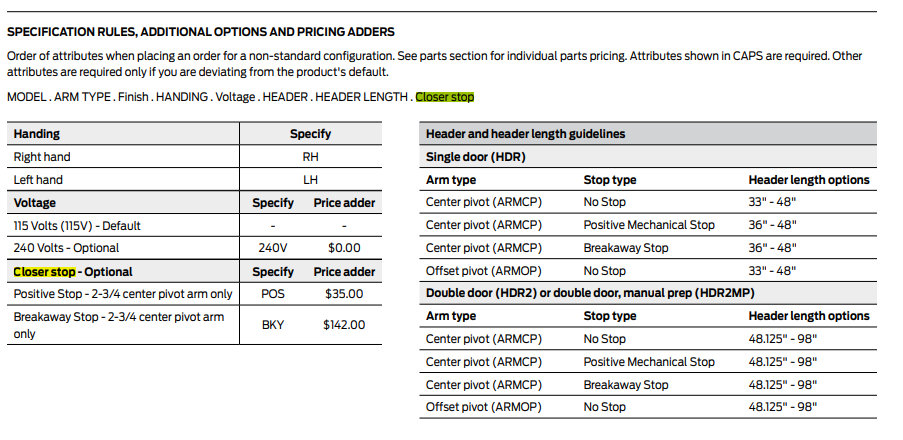

### **LCN [CAN113462_LCN_Price_Book_13_Feb2023_RevJun2023_07-05-23](./CAN113462_LCN_Price_Book_13_Feb2023_RevJun2023_07-05-23.pdf):**

**Finish Codes:**

- **Product dependent Required Params:**

- **Base price chart:**

- **Optional Params:**

- **Optional price chart:**

