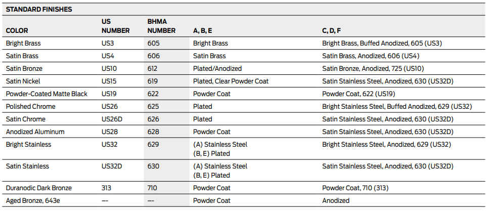
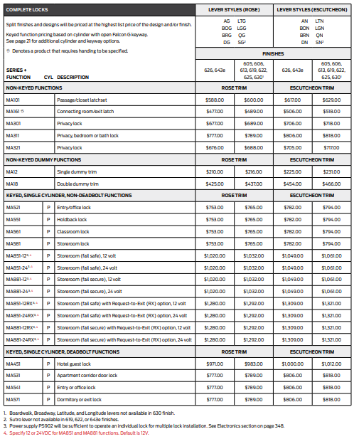
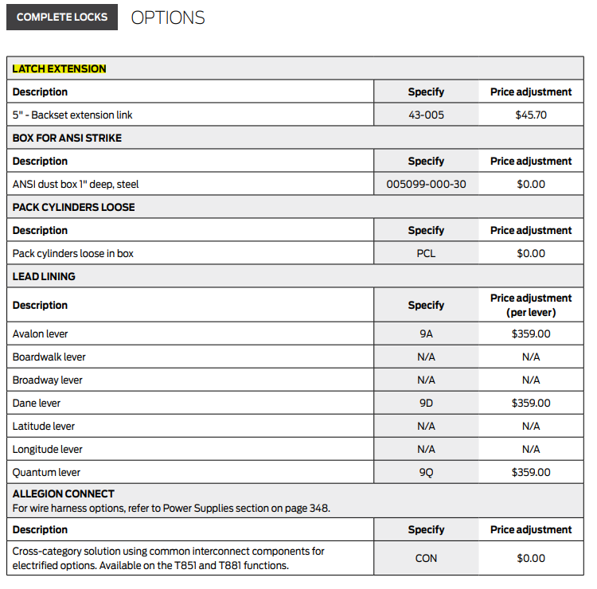
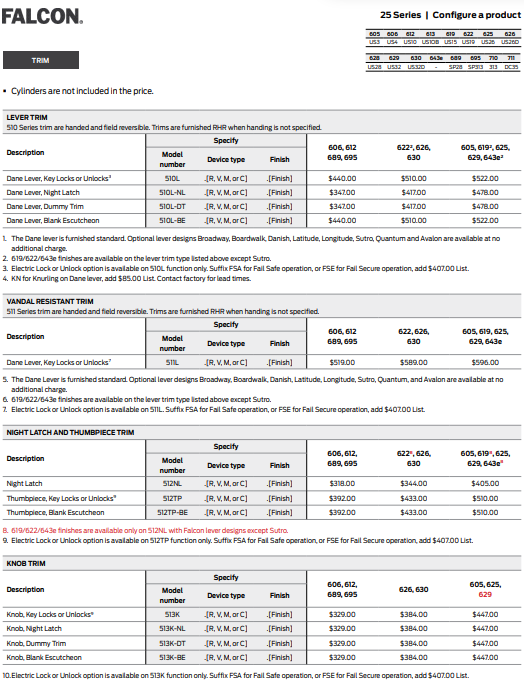
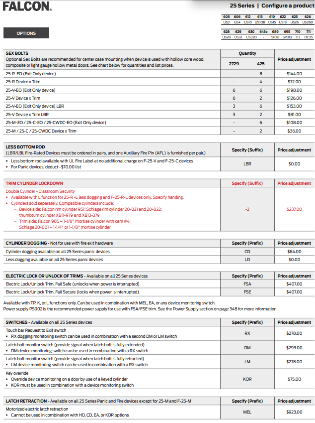
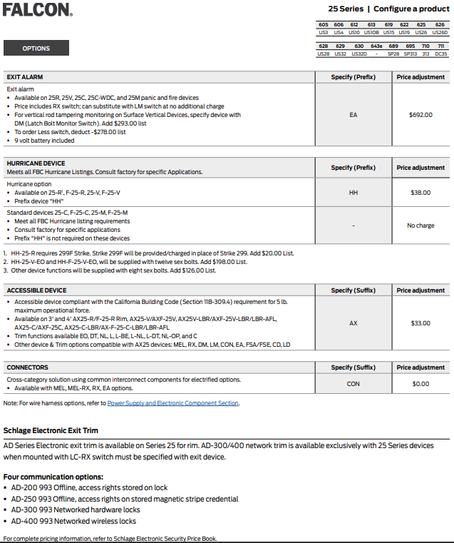

### **Falcon [CAN110065_FAL_Price_Book_13_Feb2023_RevJun2023_07-05-23](./CAN110065_FAL_Price_Book_13_Feb2023_RevJun2023_07-05-23.pdf):**
**Finish Codes:**


**1. Locks [MA series, T Series, X Series, D-200 Series etc.]:**
- **Product dependent Required Params:**


- **Base Price chart:**




- **Less component price list:**


- **Optional Params:**

`Lead lining` depends on the `Lever-outside design`.

- **Optional price list:**

  

  Optinal Params indicator
  
  


**2. Exit Devices [25 Series, 24 Series, 2390 Series etc.]:**
- **Product dependent Required Params:**


- **Base price chart:**


- **Optional Params:**
  ```mermaid
  graph TB


  subgraph Device Trim Finish Selection
  K[Possible Options]
  K --> 605
  K --> 606
  K --> 629
  K --> 695
  K --> 710
  K --> R[etc.]
  end

  subgraph Device Trim Design Selection
  A[Possible Options] --> B[Avalon/AVA]
  A --> C[Broadway/BRW]
  A --> D[Boardwalk/BRK]
  A --> E[Dane/DAN]
  A --> F[Sutro/SUT]
  A --> G[Danish/DSH]
  A --> H[Latitude/LAT]
  A --> I[Longitude/LON]
  A --> J[Quantum/QUA]
  end

  subgraph Device Trim Design Type Selection
  O[Possible Options] --> P[Standard Lever]
  O --> Q[Knurled Lever]
  end

  subgraph Device Trim Selection
  S[Possible Options] --> T[510L/Lever trim]
  S --> U[511L/Vanda-resistant lever trim]
  S --> V[L/Less trim]
  S --> W[512/Pull trim]
  S --> X[513K/Knob trim]
  S --> Y[717/Delta trim]
  end

  ```
  **Trim price chart:**

  
  

    ```mermaid
    flowchart TD


    subgraph Device Strike Selection
    A[Possible Options]
    A --> 264
    A --> 299
    A --> 3788
    A --> 2130
    A --> 1279
    A --> R[etc.]
    end
  ```
  **Strike price chart:**

  

  

  ```mermaid
    flowchart TD

    A[Accessible]
    B[Exit Alarm]
    C[Sexbolts]
    D[SLM Blocking]
    E[GBK/Shim Kit/Risers]
    P[Possible Options]
    A --> P 
    B --> P 
    C --> P 
    D --> P 
    E --> P
    P --> Y[yes] 
    P --> N[No] 
  ```
  
  ```mermaid
  graph TB

  subgraph Dogging Selection
  G[Possible Options]
  G --> H[LD: Less Dogging]
  G --> I[CD: Cylinder Dogging]
  end

  subgraph Rods for surface/concealed Selection
  D[Possible Options]
  D --> E[LBR: Less Bottom Rod]
  D --> F[LBR-AFL: Less Bottom Rod w/Auxiliary Fire Pin]
  end

  subgraph Mortise lock Selection
  A[Possible Options]
  A --> B[LL: Less Lock]
  A --> C[8500: Standard Mortise]
  end
  ```
  
  ```mermaid
  graph TB

  subgraph Storm rating Selection
  T[Possible Options]
  T --> U[HH: Wind and Impact - Hurricane Rated]
  end

  subgraph Electrical locking Selection
  Q[Possible Options]
  Q --> R[FSA: Fail Safe]
  Q --> S[FSE: Fail Secure]
  end


  subgraph Latch Retraction Selection
  O[Possible Options]
  O --> P[MEL: Motorized Electric Latch Retraction]
  end

  subgraph Switch Selection
  J[Possible Options]
  J --> K[RX: Request to Exit Pushbar Monitor]
  J --> L[DM: Latchbolt and Pushbar Monitor]
  J --> M[DM-RX: Latchbolt and Dual Pushbar Monitor]
  J --> N[KOR: Key Bypass Switch]
  end
  ```

  ```mermaid
  graph TB

  subgraph Center line Selection
  T[Possible Options]
  T --> U[40'']
  T --> V[40-1/4'']
  T --> W[40-5/16'']
  T --> X[40-9/16'']
  T --> Y[34-1/16'']
  T --> Z[etc.]
  end
  
  
  subgraph Door Thickness Selection
  O[Possible Options]
  O --> P[DT1-3/4: 1-3/'']
  O --> Q[DT2: 2'' thickness]
  O --> R[DT2-1/4: 2-1/4'']
  end


  subgraph Door Mode Material Selection
  K[Possible Options]
  K --> L[DE: Double egress doors]
  K --> M[PR: Pair of doors]
  K --> N[SGL: Single door]
  end

  
  subgraph Frame Material Selection
  G[Possible Options]
  G --> H[ALF: Aluminum frame]
  G --> I[HMF: Hollow metal frame]
  G --> J[WDF: Wood door frame]
  end

  subgraph Door Material Selection
  A[Possible Options]
  A --> B[ALD: Aluminum door]
  A --> C[CPD: Composite door]
  A --> D[HMD: Hollow metal door]
  A --> E[WDF: Wood door frame]
  A --> F[SCDC: Steel channel door construction]
  end
  ```

  
  