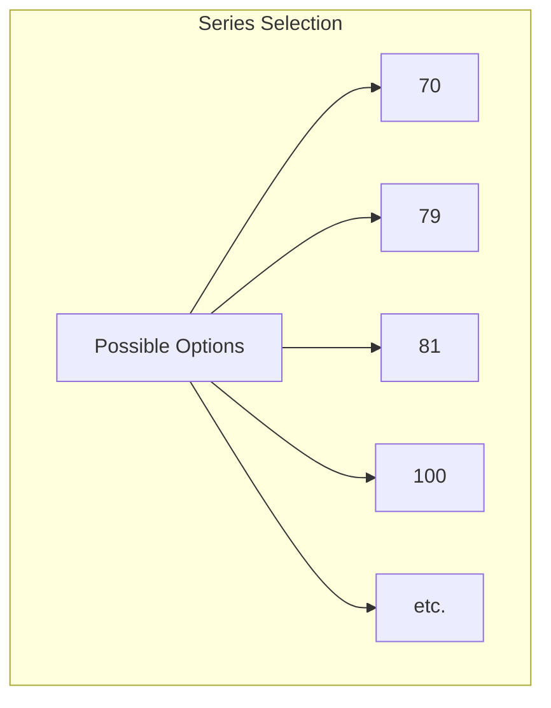
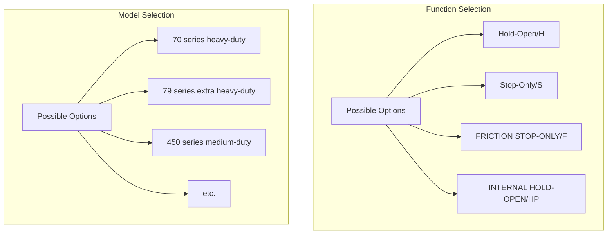
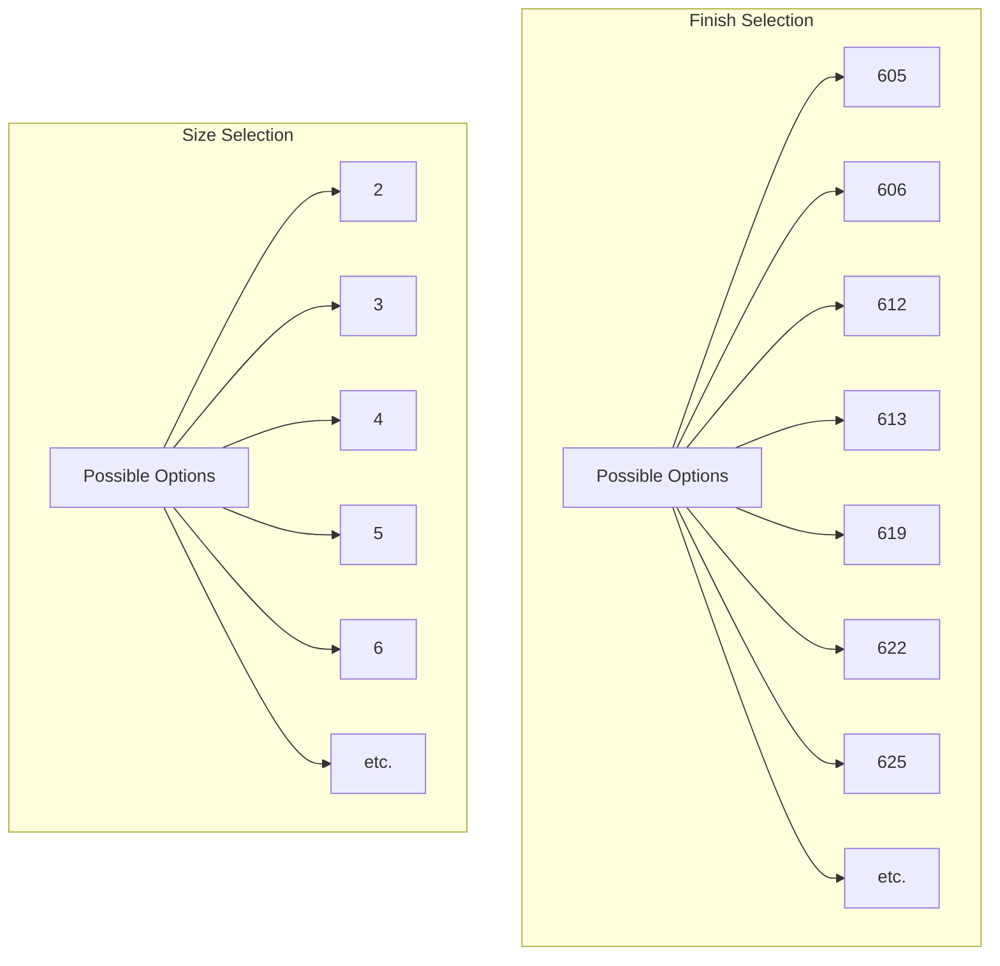
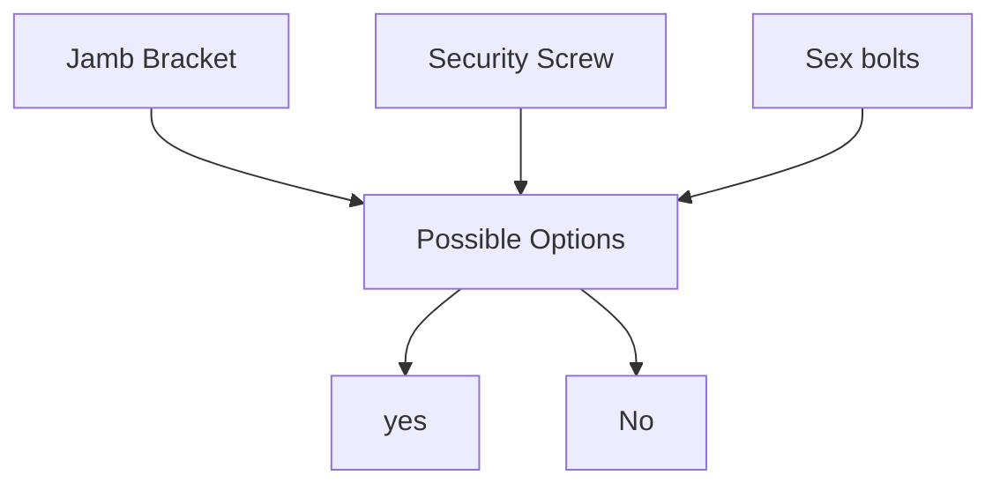
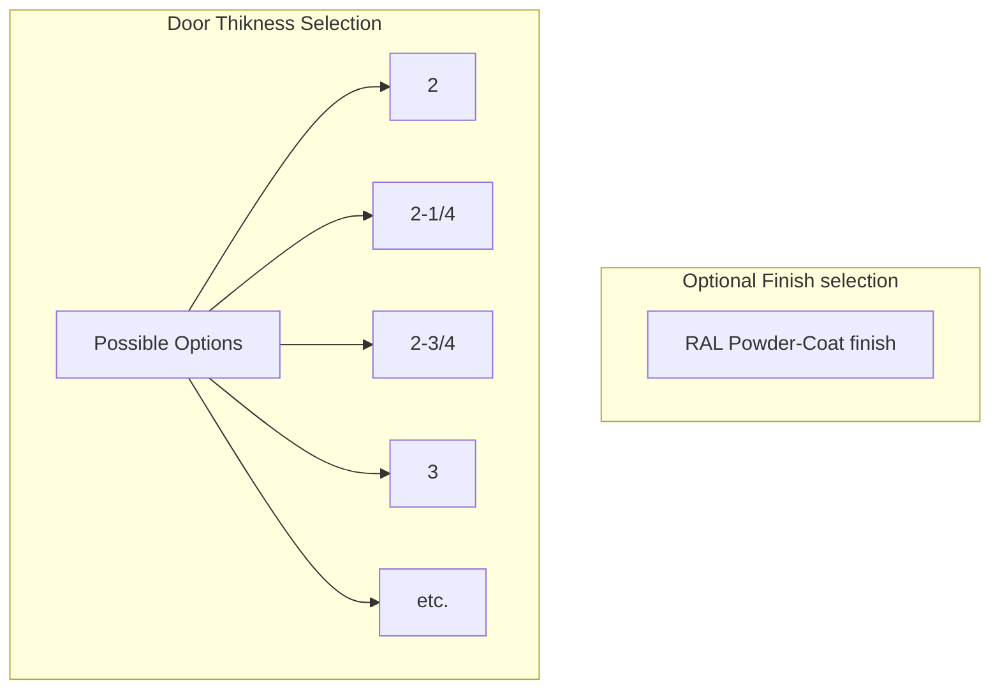
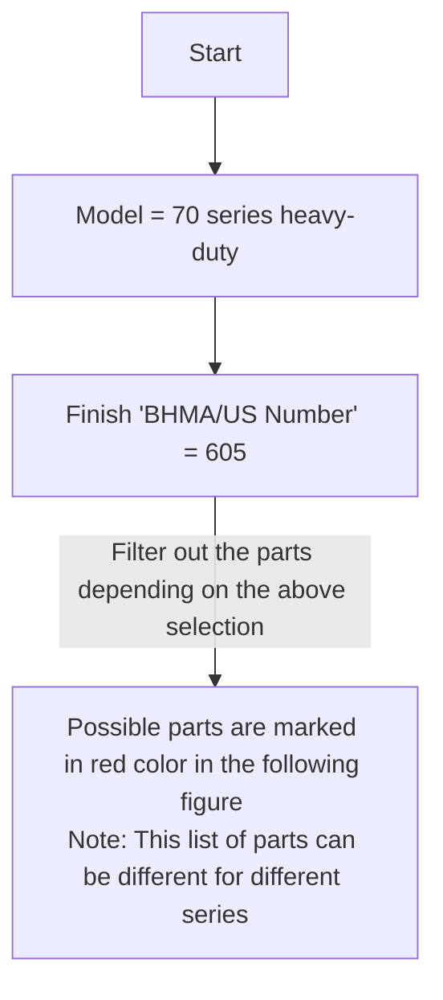
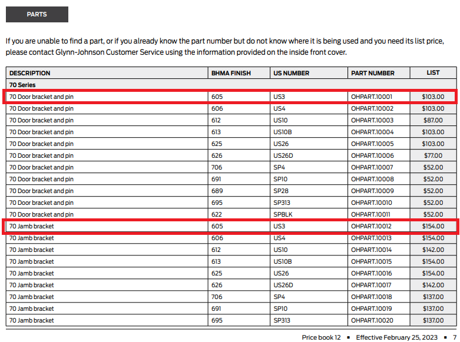

### **Glynn Jhonson [GJ_Price_Book_12_Feb2023_CAN010061](./GJ_Price_Book_12_Feb2023_CAN010061.pdf):**

**Finish Codes:**

- **Product dependent Required Params:**

- **Base Price chart:**

- **Optional Params:**

- **Optional price chart:**

- Parts selection criteria

- **Different part's Price chart:**
Parts can be treated as seperate Product.

