### **Zero [CAN110962_Zero_Price_Book_10_Feb2023_RevJun2023_07-05-23](./CAN110962_Zero_Price_Book_10_Feb2023_RevJun2023_07-05-23.pdf):**

**Finish Codes:**
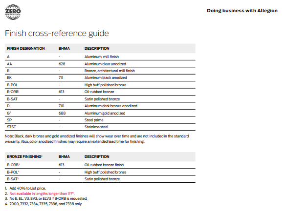
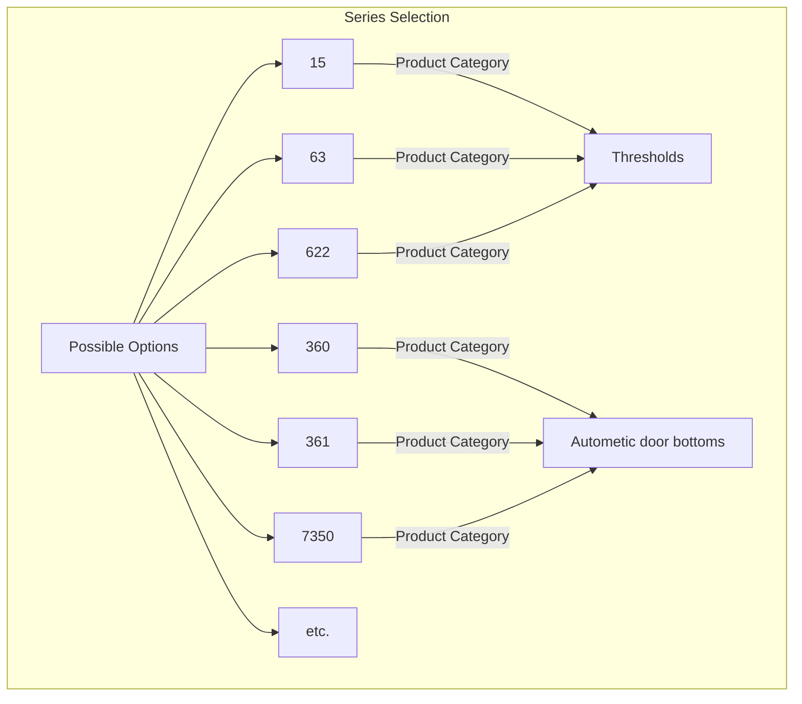
**1. Thresholds [15 series, 63 Series, 622 Series etc.]:**
- **Product dependent Required Params:**

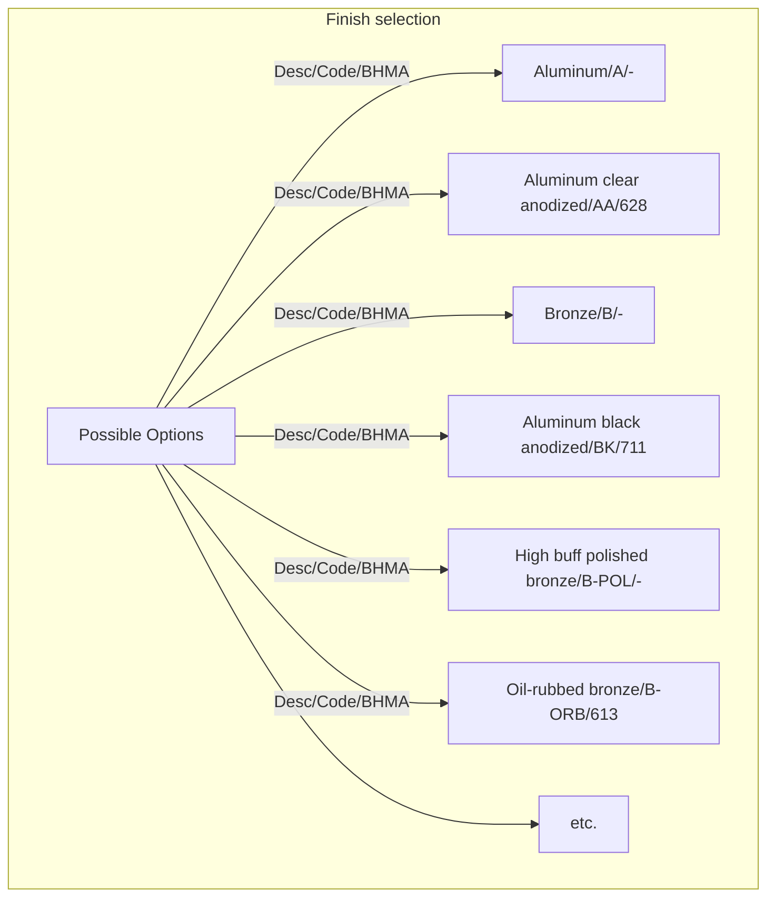
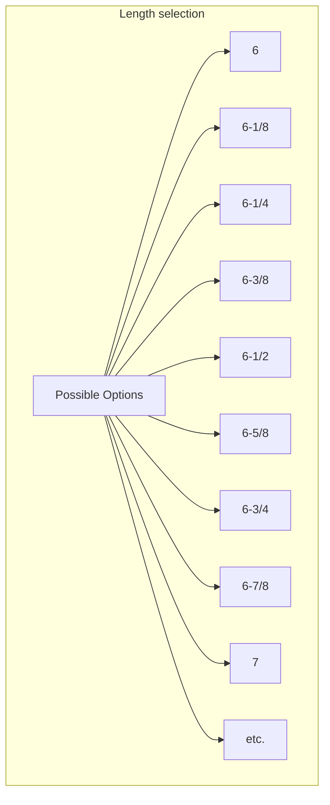
- **Base price chart:**

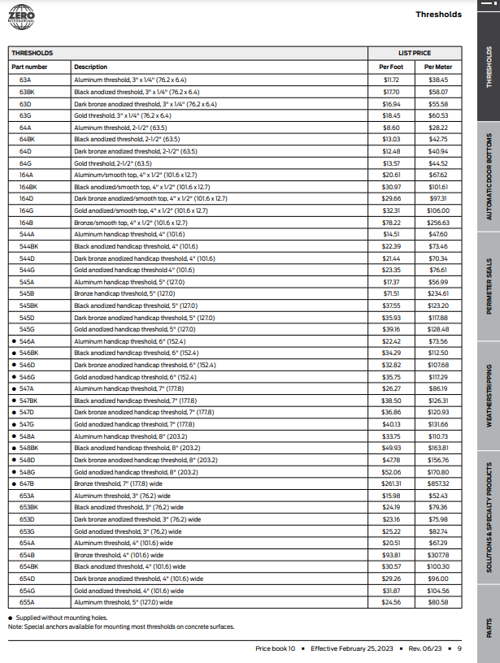

- **Product dependant Optional Params:**

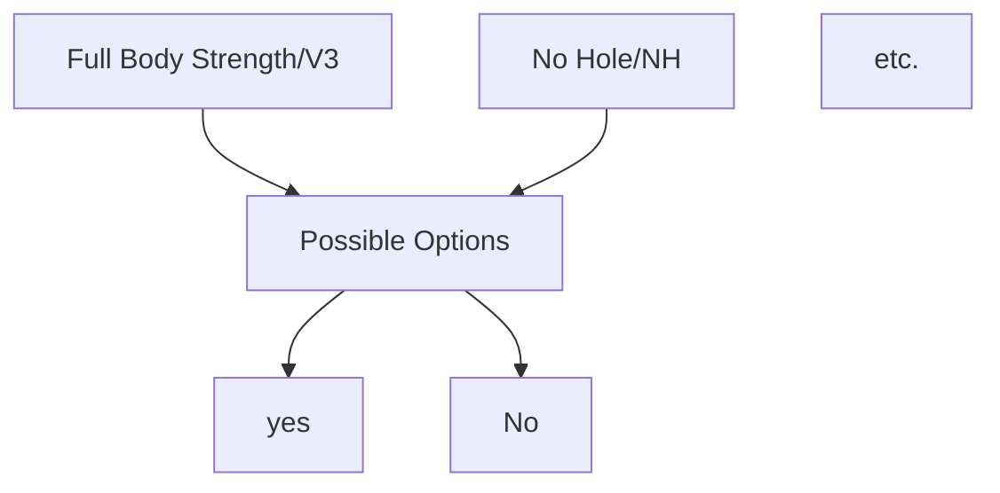
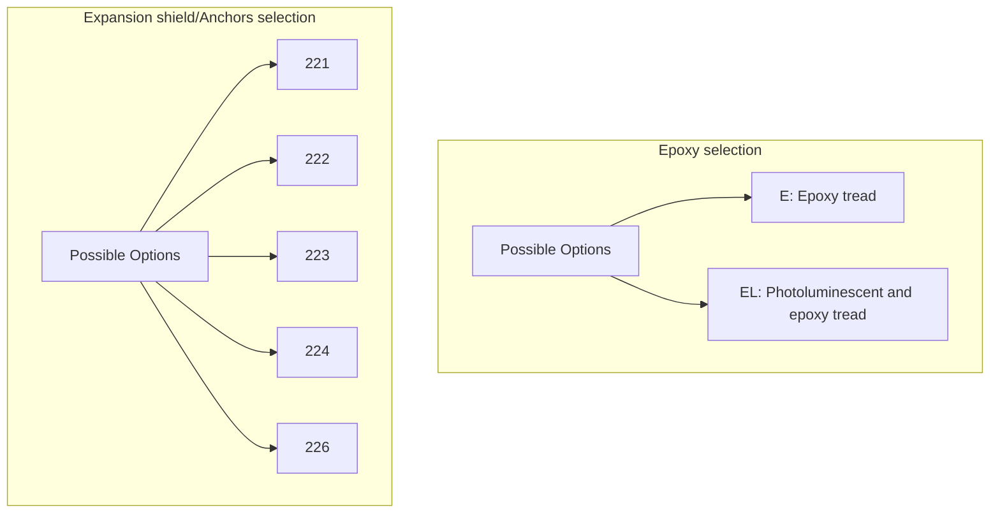
- **Optional price chart:**

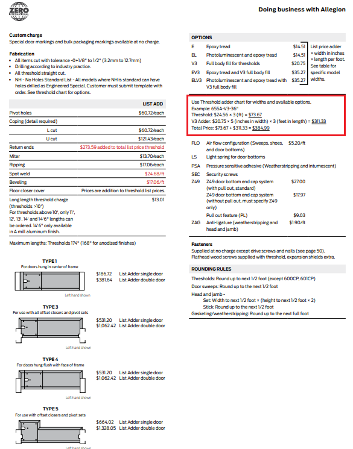
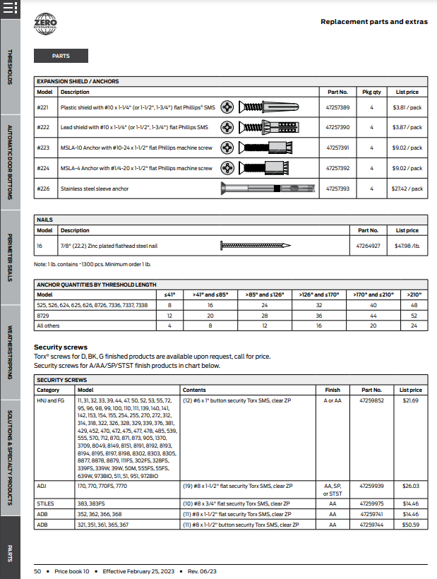

**2. Autometic door bottoms [360 series, 361 Series, 7350 Series etc.]:**
- **Product dependent Required Params:**

- **Base price chart:**

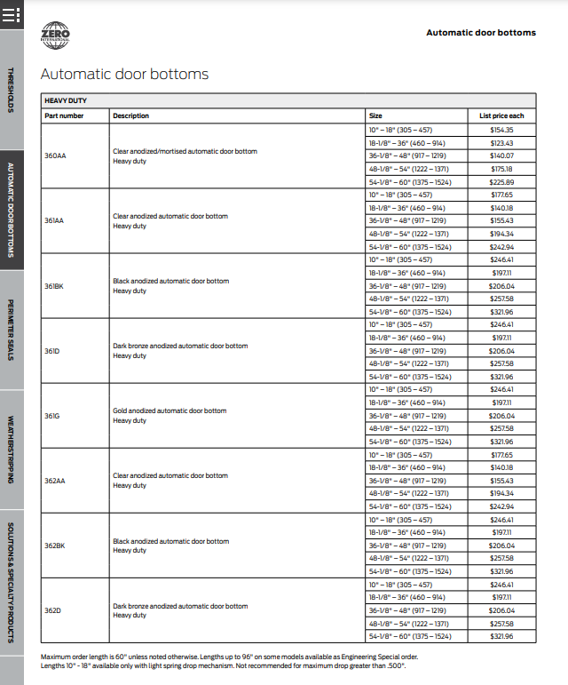

- **Product dependant Optional Params:**

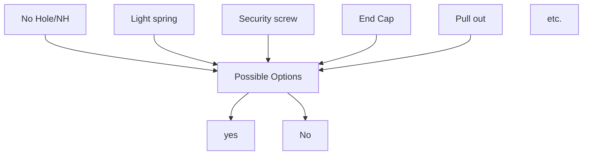
- **Optional price chart:**

- **Different part's Price chart:**
Parts can be treated as seperate Product.

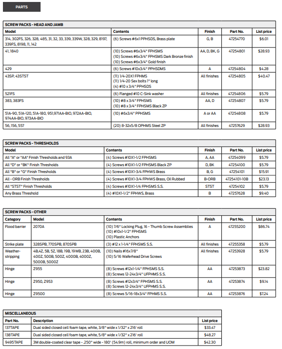