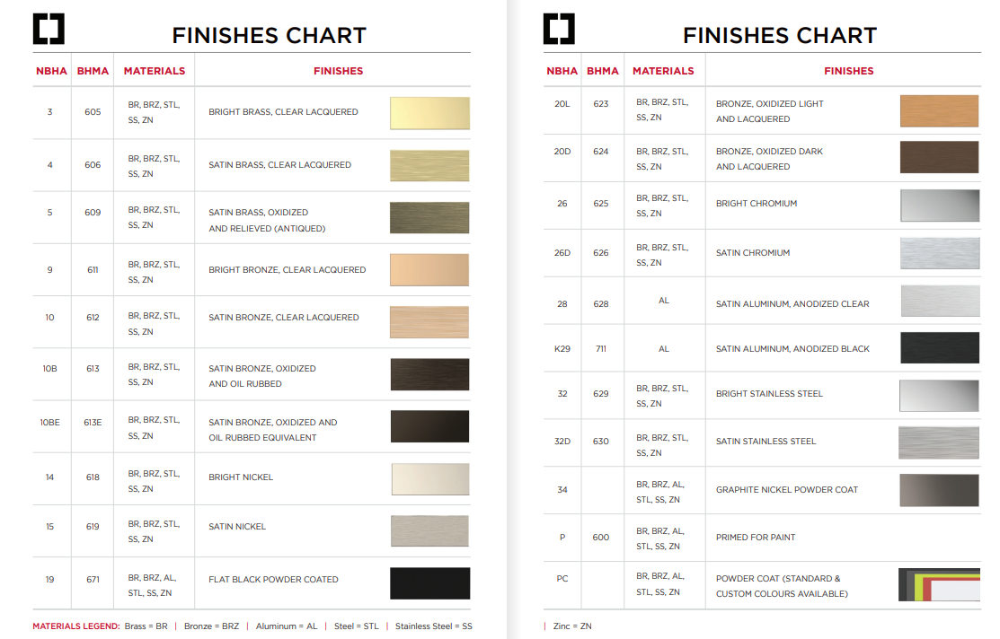
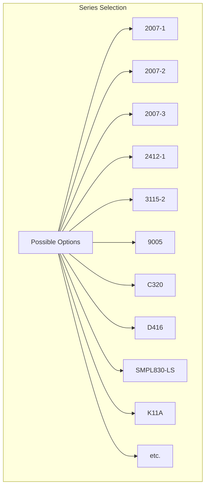
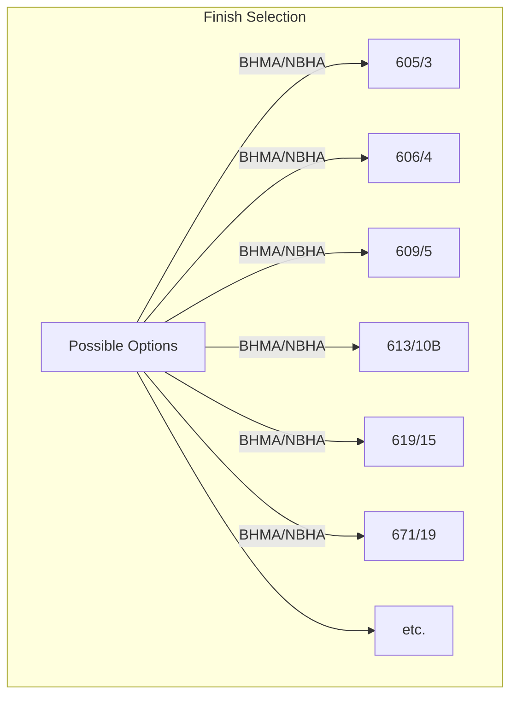
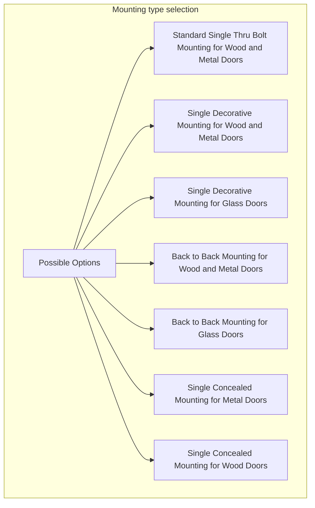
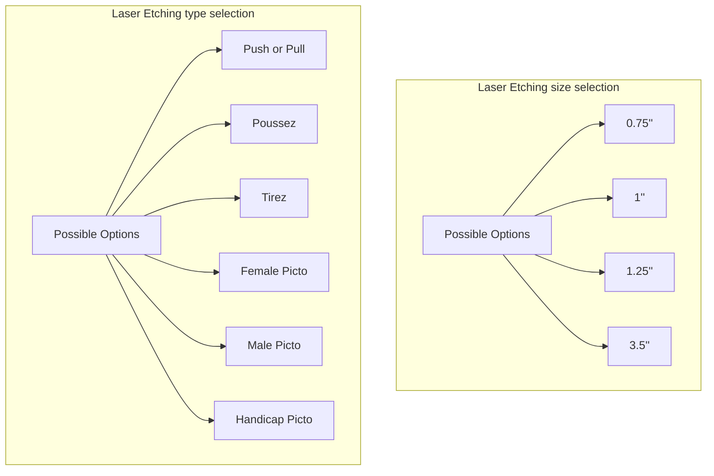
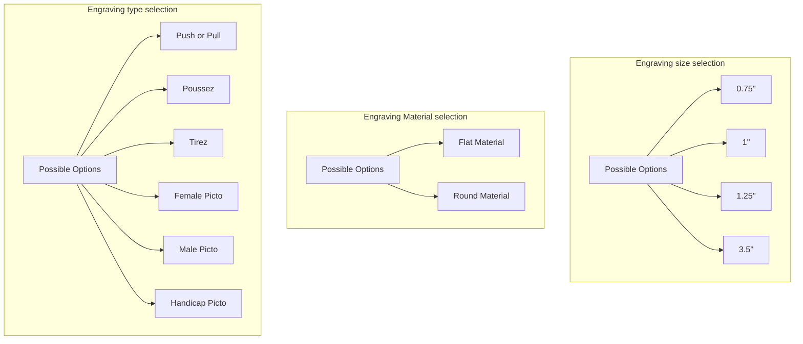
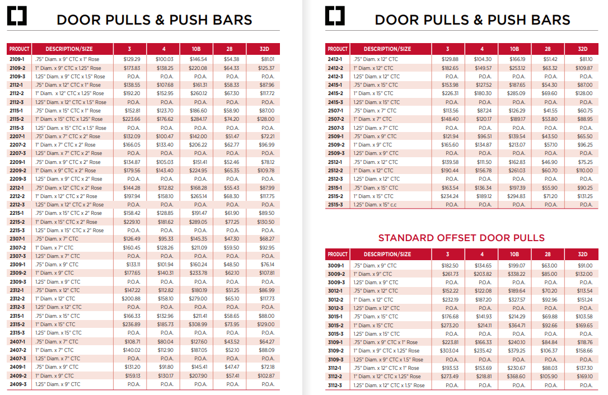
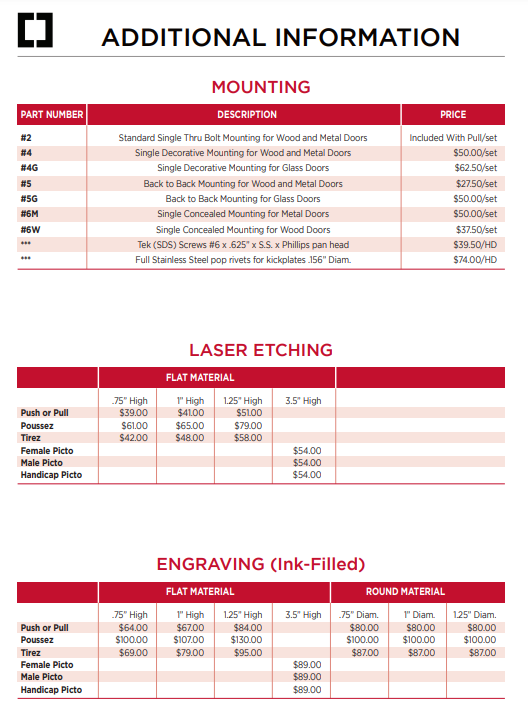

### **Standard Metal Hardware-2021 [Standard Metal Hardware - 2021 Price Book](./Standard%20Metal%20Hardware-2021%20Price%20Book.pdf):**
- Need to follow the common coding format for some parameters.

- **Product dependent Required Params:**

- **Base Price chart:**

