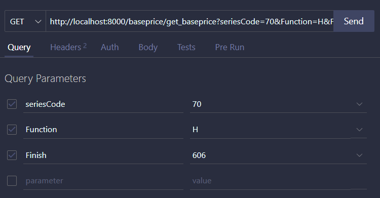
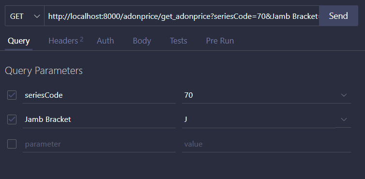

# Diamond Pricebook API Documentation

This documentation provides details for the Diamond Pricebook API collection.

## Endpoints

1. **Insert Manufacturer**

   **Method**: POST

   **URL**: [http://localhost:8000/manufacturer/insert_manufacturer](http://localhost:8000/manufacturer/insert_manufacturer)

   **Description**: Inserts a manufacturer.

   **Request Body**: 
    ```
    [
        {
            "manufacturerCode": "Allegion",
            "description": "Allegion",
            "contact": "6787654567"
        }
    ]
    ```

2. **Get Manufacturer**

    **Method**: GET

    **URL**: [http://localhost:8000/manufacturer/get_manufacturer](http://localhost:8000/manufacturer/get_manufacturer)

    **Params**: Pass `manufacturerCode` as query params for filter.
    
    **Description**: Retrieves manufacturers.

    **Response Body**:

    + Status Code: ${\color{lightgreen}200}$
    ```
    {
        "data": [
                {
                    "_id": "7cf1278b-30c2-41c5-83bd-9ade1d101f8b",
                    "manufacturerCode": "Allegion",
                    "description": "Allegion",
                    "contact": "6787654567",
                    "createdAt": "2023-09-20 13:33:57",
                    "updatedAt": "2023-09-20 13:33:57"
                }
            ],
        "status": "success"
    }
    ```

3. **Insert Brand**

    **Method**: POST

    **URL**: [http://localhost:8000/brand/insert_brand](http://localhost:8000/brand/insert_brand)

    **Description**: Inserts a brand.

    **Request Body**:
    ```
    [
        {
            "brandCode": "GJ",
            "description": "GJ",
            "contact": "9798989342",
            "manufacturerCode": "Allegion"
        }
    ]
    ```

4. **Get Brand**

    **Method**: GET

    **URL**: [http://localhost:8000/brand/get_brand](http://localhost:8000/brand/get_brand)

    **Params**: Pass `manufacturerCode`${\color{red}*}$ as query params for filter.

    **Description**: Retrieves brands based on manufacturer.

    **Response Body**:

    Status Code: ${\color{lightgreen}200}$
    ```
    {
        "data": [
                {
                    "_id": "248f7521-34f6-4c0f-a679-27cc3b709c05",
                    "brandCode": "GJ",
                    "description": "GJ",
                    "contact": "9798989342",
                    "manufacturerCode": "Allegion",
                    "createdAt": "2023-09-20 13:34:00",
                    "updatedAt": "2023-09-20 13:34:00"
                }
            ],
        "status": "success"
    }
    ```

5. **Insert Series**

    **Method**: POST

    **URL**: [http://localhost:8000/series/insert_series](http://localhost:8000/series/insert_series)

    **Description**: Inserts a series.

    **Request Body**:
    ```
    [
        {
            "manufacturerCode": "Allegion",
            "brandCode": "GJ",
            "desc": "70 series",
            "seriesCode": "70",
            "isActive": true,
            "features": [],
            "adonFeatures": []
        }
    ]
    ```


6. **Get Series**

    **Method**: GET

    **URL**: [http://localhost:8000/series/get_series](http://localhost:8000/series/get_series)

    **Params**: Pass `manufacturerCode`${\color{red}*}$, `brandCode`${\color{red}*}$ as query params for filter.

    **Description**: Retrieves series based on manufacturer and brand.

    **Response Body**:

    Status Code: ${\color{lightgreen}200}$
    ```
    {
    "data": [
            {
                "_id": "0b270d1c-e50d-4650-a98b-108dcf498125",
                "manufacturerCode": "Allegion",
                "brandCode": "LCN",
                "desc": "1000 series",
                "seriesCode": "1000",
                "isActive": true,
                "features": [
                    "90d57d74-558a-479f-8566-4622e9634127",
                    "1c442c09-76c0-4f2b-84dd-23ea3d57b5cf",
                    "e02e2063-1ef8-450f-9b5e-62a501f2f4b2",
                    "833edb42-e868-42ce-a77e-45b4a4388d9c"
                ],
                "adonFeatures": [
                    "6dacdd8f-4466-47cf-bc0f-002a0bcb7ab0"
                ],
                "createdAt": "2023-09-20 13:34:04",
                "updatedAt": "2023-09-20 13:34:04"
            }
        ],
    "status": "success"
    }
    ```

7. **Insert Feature**

    **Method**: POST

    **URL**: [http://localhost:8000/features/insert_feature](http://localhost:8000/features/insert_feature)

    **Description**: Inserts a feature.

    **Request Body**: JSON with feature data.
    ```
    {
    "seriesCode": "1000",
    "features": [
            {
                "desc": "model",
                "featureCode": "Model",
                "isActive": true,
                "availabilityCriteria": [],
                "options": [
                    {
                        "desc": "1250",
                        "optionCode": "1250",
                        "availabilityCriteria": [
                            {
                                "seriesCode": "1000"
                            }
                        ]
                    },
                    {
                        "desc": "1260",
                        "optionCode": "1260",
                        "availabilityCriteria": [
                            {
                                "seriesCode": "1000"
                            }
                        ]
                    },
                    {
                        "desc": "70 Series heavy deuty",
                        "optionCode": "70",
                        "availabilityCriteria": [
                            {
                                "seriesCode": "70"
                            }
                        ]
                    }
                ]
            },
            {
                "desc": "Arm type",
                "featureCode": "ARM",
                "isActive": true,
                "availabilityCriteria": [],
                "options": [
                    {
                        "desc": "Long",
                        "optionCode": "LONG",
                        "availabilityCriteria": []
                    },
                    {
                        "desc": "Heda",
                        "optionCode": "HEDA",
                        "availabilityCriteria": []
                    },
                    {
                        "desc": "Heda 62 G",
                        "optionCode": "HEDA62G",
                        "availabilityCriteria": []
                    }
                ]
            },
            {
                "desc": "Device Finish",
                "featureCode": "Finish",
                "isActive": true,
                "availabilityCriteria": [],
                "options": [
                    {
                        "desc": "BHMA: 616",
                        "optionCode": "616",
                        "availabilityCriteria": [
                            {
                                "seriesCode": "1000"
                            }
                        ]
                    },
                    {
                        "desc": "BHMA: 622",
                        "optionCode": "622",
                        "availabilityCriteria": []
                    },
                    {
                        "desc": "BHMA: 689",
                        "optionCode": "689",
                        "availabilityCriteria": []
                    },
                    {
                        "desc": "BHMA: 606",
                        "optionCode": "606",
                        "availabilityCriteria": [
                            {
                                "seriesCode": "70"
                            }
                        ]
                    }
                ]
            },
            {
                "desc": "Handing",
                "featureCode": "Handing",
                "isActive": true,
                "availabilityCriteria": [
                    {
                        "seriesCode": "1000",
                        "Model": "1250",
                        "ARM": "HEDA"
                    },
                    {
                        "seriesCode": "1000",
                        "Model": "1260",
                        "ARM": "HEDA"
                    },
                    {
                        "seriesCode": "1000",
                        "Model": "1260",
                        "ARM": "HEDA62G"
                    }
                ],
                "options": [
                    {
                        "desc": "Right Hand",
                        "optionCode": "RH",
                        "availabilityCriteria": [
                            {
                                "seriesCode": "1000",
                                "Model": "1260",
                                "ARM": "HEDA"
                            }
                        ]
                    },
                    {
                        "desc": "Left Hand",
                        "optionCode": "LH",
                        "availabilityCriteria": [
                            {
                                "seriesCode": "1000",
                                "Model": "1260",
                                "ARM": "HEDA62G"
                            }
                        ]
                    }
                ]
            }
        ]
    }
    ```

8. **Get Features**

    **Method**: GET

    **URL**: [http://localhost:8000/features/get_features](http://localhost:8000/features/get_features)

    **Params**: Pass `seriesCode`${\color{red}*}$ as query params for filter.

    **Description**: Retrieves features based on series code.

    **Response Body**:

    Status Code: ${\color{lightgreen}200}$
    ```
    {
    "data": [
        {
        "_id": "0b270d1c-e50d-4650-a98b-108dcf498125",
        "manufacturerCode": "Allegion",
        "brandCode": "LCN",
        "desc": "1000 series",
        "seriesCode": "1000",
        "isActive": true,
        "features": [
            {
                "_id": "1c442c09-76c0-4f2b-84dd-23ea3d57b5cf",
                "desc": "Arm type",
                "featureCode": "ARM",
                "isActive": true,
                "availabilityCriteria": [],
                "options": [
                    {
                        "desc": "Long",
                        "optionCode": "LONG",
                        "availabilityCriteria": []
                    },
                    {
                        "desc": "Heda",
                        "optionCode": "HEDA",
                        "availabilityCriteria": []
                    },
                    {
                        "desc": "Heda 62 G",
                        "optionCode": "HEDA62G",
                        "availabilityCriteria": []
                    }
                ],
                "createdAt": "2023-09-20 13:34:13",
                "updatedAt": "2023-09-20 13:34:13"
            },
            {
                "_id": "833edb42-e868-42ce-a77e-45b4a4388d9c",
                "desc": "Device Finish",
                "featureCode": "Finish",
                "isActive": true,
                "availabilityCriteria": [],
                "options": [
                    {
                        "desc": "BHMA: 616",
                        "optionCode": "616",
                        "availabilityCriteria": [
                            {
                                "seriesCode": "1000"
                            }
                        ]
                    },
                    {
                        "desc": "BHMA: 622",
                        "optionCode": "622",
                        "availabilityCriteria": []
                    },
                    {
                        "desc": "BHMA: 689",
                        "optionCode": "689",
                        "availabilityCriteria": []
                    },
                    {
                        "desc": "BHMA: 606",
                        "optionCode": "606",
                        "availabilityCriteria": [
                            {
                                "seriesCode": "70"
                            }
                        ]
                    }
                ],
                "createdAt": "2023-09-20 13:35:49",
                "updatedAt": "2023-09-20 13:35:49"
            },
            {
                "_id": "90d57d74-558a-479f-8566-4622e9634127",
                "desc": "model",
                "featureCode": "Model",
                "isActive": true,
                "availabilityCriteria": [],
                "options": [
                    {
                        "desc": "1250",
                        "optionCode": "1250",
                        "availabilityCriteria": [
                            {
                                "seriesCode": "1000"
                            }
                        ]
                    },
                    {
                        "desc": "1260",
                        "optionCode": "1260",
                        "availabilityCriteria": [
                            {
                                "seriesCode": "1000"
                            }
                        ]
                    },
                    {
                        "desc": "70 Series heavy deuty",
                        "optionCode": "70",
                        "availabilityCriteria": [
                            {
                            "seriesCode": "70"
                            }
                        ]
                    }
                ],
                "createdAt": "2023-09-20 13:35:49",
                "updatedAt": "2023-09-20 13:35:49"
            },
            {
                "_id": "e02e2063-1ef8-450f-9b5e-62a501f2f4b2",
                "desc": "Handing",
                "featureCode": "Handing",
                "isActive": true,
                "availabilityCriteria": [
                    {
                        "seriesCode": "1000",
                        "Model": "1250",
                        "ARM": "HEDA"
                    },
                    {
                        "seriesCode": "1000",
                        "Model": "1260",
                        "ARM": "HEDA"
                    },
                    {
                        "seriesCode": "1000",
                        "Model": "1260",
                        "ARM": "HEDA62G"
                    }
                ],
                "options": [
                    {
                        "desc": "Right Hand",
                        "optionCode": "RH",
                        "availabilityCriteria": [
                            {
                                "seriesCode": "1000",
                                "Model": "1260",
                                "ARM": "HEDA"
                            }
                        ]
                    },
                    {
                        "desc": "Left Hand",
                        "optionCode": "LH",
                        "availabilityCriteria": [
                            {
                                "seriesCode": "1000",
                                "Model": "1260",
                                "ARM": "HEDA62G"
                            }
                        ]
                    }
                ],
                "createdAt": "2023-09-20 13:34:13",
                "updatedAt": "2023-09-20 13:34:13"
            }
        ],
        "adonFeatures": [
            "6dacdd8f-4466-47cf-bc0f-002a0bcb7ab0"
        ],
        "createdAt": "2023-09-20 13:34:04",
        "updatedAt": "2023-09-20 13:34:04"
        }
    ],
    "status": "success"
    }
    ```

9. **Insert Additional Features**

    **Method**: POST

    **URL**: [http://localhost:8000/adonFeatures/insert_adonFeatures](http://localhost:8000/adonFeatures/insert_adonFeatures)

    **Description**: Inserts additional features.

    **Request Body**:
    ```
    {
        "seriesCode": "1000",
        "adonFeatures": [
            {
                "desc": "Cover",
                "adonFeatureCode": "Cover",
                "isActive": true,
                "availabilityCriteria": [
                    {
                        "seriesCode": "1000",
                        "Model": "1250"
                    },
                    {
                        "seriesCode": "1000",
                        "Model": "1260"
                    }
                ],
                "options": [
                    {
                        "desc": "Less cover",
                        "optionCode": "LESS",
                        "availabilityCriteria": []
                    },
                    {
                        "desc": "Simple plastic Cover",
                        "optionCode": "SLMIPC",
                        "availabilityCriteria": []
                    }
                ]
            }
        ]
    }

    ```

10. **Get Additional Features**

    **Method**: GET

    **URL**: [http://localhost:8000/adonFeatures/get_adonFeatures](http://localhost:8000/adonFeatures/get_adonFeatures)

    **Params**: Pass `seriesCode`${\color{red}*}$ as query params for filter.

    **Description**: Retrieves additional features based on series code.

    **Response Body**:
    
    Status Code: ${\color{lightgreen}200}$
    ```
    {
    "data": [
        {
            "_id": "0b270d1c-e50d-4650-a98b-108dcf498125",
            "manufacturerCode": "Allegion",
            "brandCode": "LCN",
            "desc": "1000 series",
            "seriesCode": "1000",
            "isActive": true,
            "features": [
                "90d57d74-558a-479f-8566-4622e9634127",
                "1c442c09-76c0-4f2b-84dd-23ea3d57b5cf",
                "e02e2063-1ef8-450f-9b5e-62a501f2f4b2",
                "833edb42-e868-42ce-a77e-45b4a4388d9c"
            ],
            "adonFeatures": [
                {
                    "_id": "6dacdd8f-4466-47cf-bc0f-002a0bcb7ab0",
                    "desc": "Cover",
                    "adonFeatureCode": "Cover",
                    "isActive": true,
                    "availabilityCriteria": [
                        {
                            "seriesCode": "1000",
                            "Model": "1250"
                        },
                        {
                            "seriesCode": "1000",
                            "Model": "1260"
                        }
                    ],
                    "options": [
                        {
                            "desc": "Less cover",
                            "optionCode": "LESS",
                            "availabilityCriteria": []
                        },
                        {
                            "desc": "Simple plastic Cover",
                            "optionCode": "SLMIPC",
                            "availabilityCriteria": []
                        }
                    ],
                    "createdAt": "2023-09-20 13:36:48",
                    "updatedAt": "2023-09-20 13:36:48"
                }
            ],
            "createdAt": "2023-09-20 13:34:04",
            "updatedAt": "2023-09-20 13:34:04"
        }
    ],
    "status": "success"
    }
    ```


11. **Insert Base Price**

    **Method**: POST

    **URL**: [http://localhost:8000/baseprice/insert_baseprice](http://localhost:8000/baseprice/insert_baseprice)

    **Description**: Inserts a base price.

    **Request Body**: JSON with base price data.
    ```
    [
        {
            "seriesCode": "1000",
            "Model": "1250",
            "ARM": "LONG",
            "Finish": "622",
            "isActive": true,
            "pricePerQuantity": [
                {
                    "unit": "Foot",
                    "price": 276
                }
            ]
        }
    ]
    ```

12. **Get Base Price**

    **Method**: GET

    **URL**: [http://localhost:8000/baseprice/get_baseprice](http://localhost:8000/baseprice/get_baseprice)

    **Params**: Pass `seriesCode` ${\color{red}*}$ and `different feature codes as key and selected option as value`${\color{red}*}$ as query params for filter.

    

    **Description**: Retrieves base prices based on series code and function.

    **Response Body**:
    
    Status Code: ${\color{lightgreen}200}$
    ```
    {
    "data": [
        {
            "_id": "b2be4a5e-49f7-4853-a431-86ffffd0f32b",
            "seriesCode": "70",
            "Model": "70",
            "Finish": "606",
            "Function": "H",
            "Size": "2",
            "isActive": true,
            "pricePerQuantity": [
                {
                    "unit": "Piece",
                    "price": 371
                }
            ],
            "createdAt": "2023-09-20 13:37:44",
            "updatedAt": "2023-09-20 13:37:44"
        }
    ],
    "status": "success"
    }
    ```


13. **Insert Additional Price**

    **Method**: POST

    **URL**: [http://localhost:8000/adonprice/insert_adonprice](http://localhost:8000/adonprice/insert_adonprice)

    **Description**: Inserts additional prices.

    **Request Body**: JSON with additional price data.
    ```
    [
        {
            "seriesCode": "1000",
            "Cover": "LESS",
            "desc": "Less cover",
            "isActive": true,
            "pricePerQuantity": [
                {
                    "unit": "Piece",
                    "price": 0
                }
            ]
        }
    ]
    ```

14. **Get Additional Price**

    **Method**: GET

    **URL**: [http://localhost:8000/adonprice/get_adonprice](http://localhost:8000/adonprice/get_adonprice)

    **Params**: Pass `seriesCode` ${\color{red}*}$ and `different adon feature codes as key and selected option as value`${\color{red}*}$ as query params for filter.

    
    
    **Description**: Retrieves additional prices based on series code.

    **Response Body**:
    
    Status Code: ${\color{lightgreen}200}$
    ```
    {
    "data": [
        {
            "_id": "fa932a01-c31d-4bb6-816d-c6ff4bdc97d6",
            "seriesCode": "70",
            "desc": "J: standard Jamb Bracket",
            "Jamb Bracket": "J",
            "isActive": true,
            "pricePerQuantity": [
                {
                    "unit": "Piece",
                    "price": 83
                }
            ],
            "createdAt": "2023-09-20 13:37:47",
            "updatedAt": "2023-09-20 13:37:47"
        }
    ],
    "status": "success"
    }
    ```


